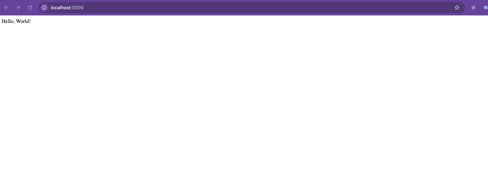

# Simple Flask Server Application

## Table of Contents
- [Introduction](#introduction)
- [Prerequisites](#prerequisites)
- [Navigate to the Application Directory](#navigate-to-the-application-directory)
- [Install Flask](#install-flask)
- [Code Explanation](#code-explanation)
- [Run the Application](#run-the-application)
- [Final Objective](#final-objective)
- [Next Steps](#next-steps)

---

## Introduction

In this class, you will learn how to run a simple server application using Python and Flask.

---

## Prerequisites

Ensure you have Python installed on your system. You can verify this by running:

```bash
python3 --version
````

---

## Navigate to the Application Directory

Navigate to the `exercise1` directory where the application files are located:

```bash
cd sre-academy-training/exercises/exercise1
```

---

## Install Flask

Flask is a lightweight WSGI web application framework in Python. To install Flask, use pip:

```bash
pip3 install Flask
```

---

**Note for macOS users on IBM-managed laptops:**

> If you encounter the following error when running pip3 install Flask:
>
> ```
> error: externally-managed-environment
> × This environment is externally managed
> ╰─> To install Python packages system-wide, try brew install xyz
> ```
>
> This means your system is enforcing PEP 668 and is preventing system-wide package installs using pip. To fix this, follow the virtual environment steps listed below.

> Starting with Python 3.12+, IBM laptops using Homebrew-managed Python environments enforce [PEP 668](https://peps.python.org/pep-0668/). This means `pip install flask` will fail unless you are inside a virtual environment.

> Use the following to create and activate a virtual environment:

```bash
python3 -m venv venv
source venv/bin/activate
pip install flask
```

> This restriction typically does **not** apply to personal laptops, desktops, or Linux environments unless using similar system-managed Python setups.

---

## Code Explanation

The code creates a Flask application with two main endpoints:

1. A root endpoint (`/`) that returns a "Hello, World!" message.
2. An endpoint for retrieving store information (`/store`).

### Code Breakdown

```python
from flask import Flask, request

app = Flask(__name__)
```

* **Importing Flask**: This imports the Flask class from the `flask` library.
* **Initializing the App**: `app = Flask(__name__)` creates an instance of the Flask application.

```python
@app.route('/')
def hello_world():
    return 'Hello, World!'
```

* **Root Route (`/`)**: This is a basic endpoint that listens on the root (`/`) URL. When accessed, it returns the plain text message "Hello, World!".

```python
stores = [
    {
        "name": "My Store",
        "items": [
            {
                "name": "Chair",
                "price": 15.99
            }
        ]
    }
]
```

* **Stores Data**: This is a simple data structure representing a store. It contains an array of items, with each item represented by its name and price.

```python
@app.get('/store')
def get_stores():
    return {"stores": stores}
```

* **Get Stores Route (`/store`)**: This endpoint returns a JSON object containing all stores. The `@app.get('/store')` decorator defines this route, making it accessible via a GET request.

```python
if __name__ == '__main__':
    app.run(host='0.0.0.0', port=5000)
```

* **Running the App**: This conditional statement checks if the script is run directly (rather than imported as a module). If it is, the Flask application starts up, listening on all network interfaces (`0.0.0.0`) at port `5000`.

---

## Run the Application

To run the Flask application, execute the following command from the `exercise1` directory:

```bash
python3 app.py
```

Once the application is running, open your browser and visit the following URL:

* `http://127.0.0.1:5000/`

You should see the following message:

```
Hello, World!
```

---

## Final Objective

At the end of this exercise, you should accomplish the following:

> **\[!IMPORTANT]**
> Once the application is running, open your web browser and go to `http://127.0.0.1:5000/`. You should see the text **"Hello, World!"** displayed.
>
> 

---

## Next Steps

Now that you've successfully run your first Flask application:

* Proceed to [Exercise 2](../exercise2/), where you'll learn how to package this Python app into a Docker container.
* This is your first step toward cloud-native development and deployment using containers.

---