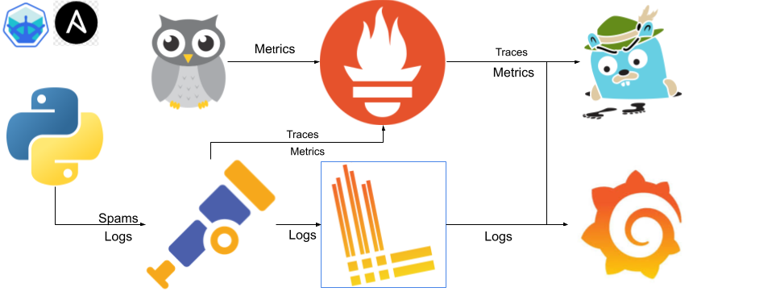
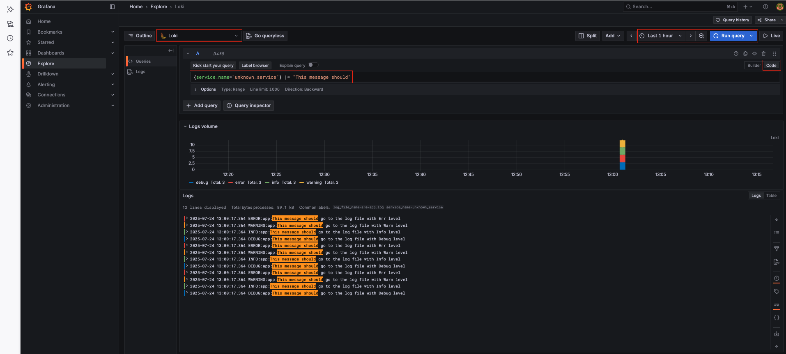

# Application Logging and Observability with OpenTelemetry and Grafana Loki

## Table of Contents

* [Overview](#overview)
* [Understanding the Setup](#understanding-the-setup)

  * [Application Logging with OpenTelemetry](#application-logging-with-opentelemetry)
  * [Shared Log Volume Configuration](#shared-log-volume-configuration)
  * [OpenTelemetry Collector Configuration](#opentelemetry-collector-configuration)
  * [Grafana Loki Setup](#grafana-loki-setup)
  * [Prometheus RBAC Setup](#prometheus-rbac-setup)
  * [Grafana Integration (Datasource & Dashboard)](#grafana-integration-datasource--dashboard)
* [Execution Steps](#execution-steps)
* [Verification](#verification)

---

## **Overview**

In this exercise, we will enable **logging for a Python application** and integrate it with **OpenTelemetry, Loki, and Grafana** to visualize logs. The goal is to capture logs generated by the application, store them in a **shared log volume**, and forward them to **Grafana Loki** for centralized monitoring.

The key components of this setup are:

* **Python Application Logging**: Configured to write logs to `/app/logs/sre-app.log` within its container.
* **Persistent Storage (PVC + PV)**: Ensures logs are available and shared between the application and the OpenTelemetry Collector.
* **OpenTelemetry Collector**: Reads logs from the shared volume and forwards them to **Loki**.
* **Grafana Loki**: Stores logs and provides an interface to query them.
* **Grafana Dashboard**: Visualizes application logs and provides insights, especially for errors.

By the end of this exercise, you will be able to analyze application logs in **Grafana** using Loki as the log backend.



The configurations in this exercise primarily correspond to the blue square in the diagram above, focusing on the logging pipeline.

---

## **Understanding the Setup**

This section breaks down how the logging pipeline works by highlighting the most important code and configuration changes needed to support log forwarding from the application to Grafana via Loki and the OpenTelemetry Collector.

---

### **Application Logging with OpenTelemetry**

The Python application is configured to generate structured logs and write them to a file. These logs are later collected by the OpenTelemetry Collector.

Inside `app.py`, logs are written explicitly to a file (`/var/log/sre-app/sre-app.log`) using a `FileHandler`:

```python
file_handler = FileHandler('/var/log/sre-app/sre-app.log')
file_handler.setLevel(logging.DEBUG)
formatter = logging.Formatter('%(asctime)s %(levelname)s %(name)s %(message)s')
file_handler.setFormatter(formatter)
logger.addHandler(file_handler)
```

Additionally, OpenTelemetry logging instrumentation is configured to export logs:

```python
log_exporter = OTLPLogExporter(
    endpoint="otel-collector.opentelemetry.svc.cluster.local:4317",
    insecure=True
)

log_processor = BatchLogRecordProcessor(log_exporter)
logger_provider.add_log_record_processor(log_processor)

otel_handler = LoggingHandler(logger_provider=logger_provider)
logger.addHandler(otel_handler)
```

The result is that the app logs both to file (for file scraping by the collector) and directly over OTLP (for redundancy and testing purposes).

---

### **Shared Log Volume Configuration**

We use **two PersistentVolumes (PVs)** backed by the same host directory on the Minikube VM (`/data/sre-app/logs`). These volumes are then mounted to both the app and the collector via PVCs.

Below is an excerpt from the `PersistentVolume` definition:

```yaml
apiVersion: v1
kind: PersistentVolume
metadata:
  name: log-pv-1
spec:
  capacity:
    storage: 500Mi
  accessModes:
    - ReadWriteMany
  hostPath:
    path: /data/sre-app/logs
```

The `application` namespace claims this volume like so:

```yaml
kind: PersistentVolumeClaim
metadata:
  name: log-pvc
  namespace: application
spec:
  volumeName: log-pv-1
  accessModes:
    - ReadWriteMany
  resources:
    requests:
      storage: 500Mi
```

Then, the app `deployment.yaml` mounts this shared PVC to the container:

```yaml
volumeMounts:
  - mountPath: /var/log/sre-app
    name: log-volume

volumes:
  - name: log-volume
    persistentVolumeClaim:
      claimName: log-pvc
```

This makes sure logs written to `/var/log/sre-app/sre-app.log` by the app are readable by the OpenTelemetry Collector.

---

### **OpenTelemetry Collector Configuration**

The collector is configured with a `filelog` receiver to **tail log files** from the shared volume and an `otlphttp/loki` exporter to forward them to Loki.

Here’s a relevant excerpt from `otel-collector.yaml`:

```yaml
receivers:
  filelog:
    include: [ /var/log/sre-app/*.log ]
    start_at: beginning
    operators:
      - type: json_parser
        timestamp:
          parse_from: attributes.time
        severity:
          parse_from: body.level
        message:
          parse_from: body.message
```

And the `exporters` section:

```yaml
exporters:
  otlphttp/loki:
    endpoint: http://loki.opentelemetry.svc.cluster.local:3100/loki/api/v1/push
```

The `service` section ties everything together:

```yaml
service:
  pipelines:
    logs:
      receivers: [filelog]
      processors: []
      exporters: [otlphttp/loki]
```

The OpenTelemetry Collector is deployed in the `opentelemetry` namespace and mounts its own PVC (pointing to the same hostPath on Minikube).

---

### **Grafana Loki Setup**

Grafana Loki runs as a standalone deployment and receives logs via HTTP from the Collector. It listens on port `3100`.

Here’s the Loki `Service` definition:

```yaml
apiVersion: v1
kind: Service
metadata:
  name: loki
  namespace: opentelemetry
spec:
  ports:
    - port: 3100
      targetPort: 3100
  selector:
    app: loki
```

No additional configuration is required beyond ensuring the endpoint matches the one defined in the `otel-collector.yaml` exporter.

---

### **Prometheus RBAC Setup**

Prometheus needs **cluster-level permissions** to discover pods, endpoints, and services.

Below is a simplified `ClusterRole` definition:

```yaml
apiVersion: rbac.authorization.k8s.io/v1
kind: ClusterRole
metadata:
  name: prometheus-pod-reader-cluster
rules:
  - apiGroups: [""]
    resources: ["pods", "endpoints"]
    verbs: ["get", "list", "watch"]
```

And the `ClusterRoleBinding`:

```yaml
kind: ClusterRoleBinding
metadata:
  name: prometheus-pod-reader-binding-cluster
subjects:
  - kind: ServiceAccount
    name: default
    namespace: monitoring
roleRef:
  kind: ClusterRole
  name: prometheus-pod-reader-cluster
  apiGroup: rbac.authorization.k8s.io
```

This ensures Prometheus running in the `monitoring` namespace has visibility into all required Kubernetes resources.

---

### **Grafana Integration (Datasource & Dashboard)**

Grafana is configured to use Loki as a data source, and we also deploy a dashboard with a panel that filters errors.

Datasource config snippet from `grafana.yaml`:

```yaml
apiVersion: 1
datasources:
  - name: Loki
    type: loki
    access: proxy
    url: http://loki.opentelemetry.svc.cluster.local:3100
    jsonData:
      maxLines: 1000
```

Example log panel query:

```logql
{service_name="unknown_service"} |= "goo encountered an error"
```

This panel allows us to **track application errors in real time** using log filtering.

---

## **Execution Steps**

1. **Navigate to the Exercise Directory:**

   ```bash
   cd sre-academy-training/exercises/exercise10
   ```

2. **Run the Deployment Script:**

   This script will perform a complete cleanup of previous Minikube/Colima states, start a fresh Minikube cluster, build your application image, and deploy all Kubernetes resources.

   ```bash
   ./cluster.sh
   ```

   > This may take several minutes on the first run.

---

## **Validate Logs in Grafana (Loki)**

1. Go to **Explore** in the Grafana sidebar.

2. Select the **`Loki`** data source from the dropdown.

3. In the query field, paste the following code:

   ```logql
   {service_name="unknown_service"} |= "This message should"
   ```

4. Click **Run query**.

You should now see logs for all levels: `DEBUG`, `INFO`, `WARNING`, and `ERROR` — confirming that Loki is collecting logs from your app.

---

## **Final Objective**

By completing this exercise, you should be able to:

* View **trace-based logs** using **Grafana Explore**.
* Use **Loki** as a centralized log aggregator.
* Filter and identify logs by **log level** (e.g., `debug`, `info`, `warning`, `error`).
* Analyze log **volume and frequency over time** using built-in visualizations.

### Example Output

* **Log Volume Graph**

  This graph displays the volume of logs over time, grouped by severity. It helps visualize when peaks in logging activity occur and whether specific levels (like `ERROR`) spike unexpectedly.

  

* **Logs Table with Highlighted Entries**

  This panel shows a list of structured logs captured by Loki. You can see multiple log levels (`DEBUG`, `INFO`, `WARNING`, `ERROR`) with the message:

  

---

## Next Steps

In [Exercise 11](../exercise11), you will learn how to effectively monitor your application and Kubernetes cluster using the **Golden Signals** framework (Latency, Traffic, Errors, and Saturation) within **Grafana**. This exercise will show you how to build insightful dashboards using the Prometheus and OpenTelemetry data you've configured.

You should now be confident with:

* Deploying a comprehensive monitoring stack including Prometheus, Grafana, Loki, and OpenTelemetry Collector.
* Understanding the role of each component in collecting, storing, and visualizing metrics and logs.
* Configuring persistent storage for your monitoring tools.
* Ensuring your application is integrated with the observability pipeline.

---