# **Observability with Golden Signals in Grafana**

## **Table of Contents**

- [Observability Approach](#observability-approach)
  - [What Are the Golden Signals?](#what-are-the-golden-signals)
  - [Latency](#latency)
  - [Traffic](#traffic)
  - [Errors](#errors)
  - [Saturation](#saturation)
- [Deployment](#deployment)
- [Troubleshooting Prometheus Targets](#troubleshooting-prometheus-targets)
- [Final Objective](#final-objective)
- [Next Steps](#next-steps)

---

## **Important Note About Dashboards**

All **Grafana dashboards and panels** used in this exercise are provisioned **automatically** using the configuration defined in `grafana.yaml`. This means:

- You do **not** need to manually create or configure dashboards or panels.
- The Prometheus and LogQL queries shown throughout this guide are for **reference only**, to help you understand how each panel works and what data it visualizes.

---

## **Observability Approach**

This exercise focuses on **observability** using the **Golden Signals** framework in **Site Reliability Engineering (SRE)**. The Golden Signals—**Latency, Traffic, Errors, and Saturation**—are key indicators of system health. They enable SREs to detect performance degradation, troubleshoot issues, and optimize resource allocation.

This exercise builds on previous ones, using:

- **Grafana** for visualization  
- **Prometheus** for metric collection  
- **OpenTelemetry** for distributed tracing  

The infrastructure remains the same as in **Exercise 10**, as we are enhancing monitoring **inside Grafana**.

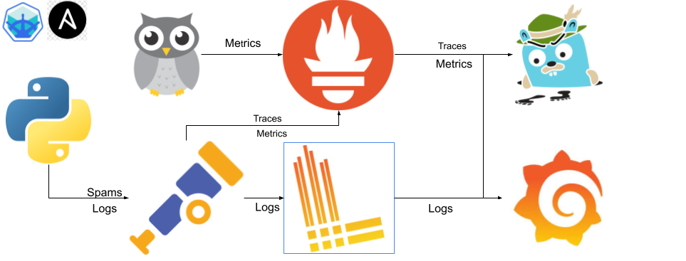

The following configurations correspond to the **blue square** in the diagram above.

---

## **Navigate to the Directory**

Before proceeding, navigate to the correct directory:

```bash
cd sre-academy-training/exercises/exercise11
````

---

## **Golden Signals for Observability**

The **Golden Signals** framework provides four key metrics that help **Site Reliability Engineers (SREs)** monitor and troubleshoot system performance issues. These signals help detect latency spikes, network congestion, high error rates, and resource saturation before they impact users.

---

### **1. Latency**

**Definition:** The time it takes to process a request. Latency includes both **successful** and **failed** requests, but the focus is on measuring **successful response times** as a key indicator of system performance.

**Prometheus Query (used in provisioned panel):**

```promql
sum(rate(otel_collector_span_metrics_duration_milliseconds_bucket[5m])) by (span_name)
```

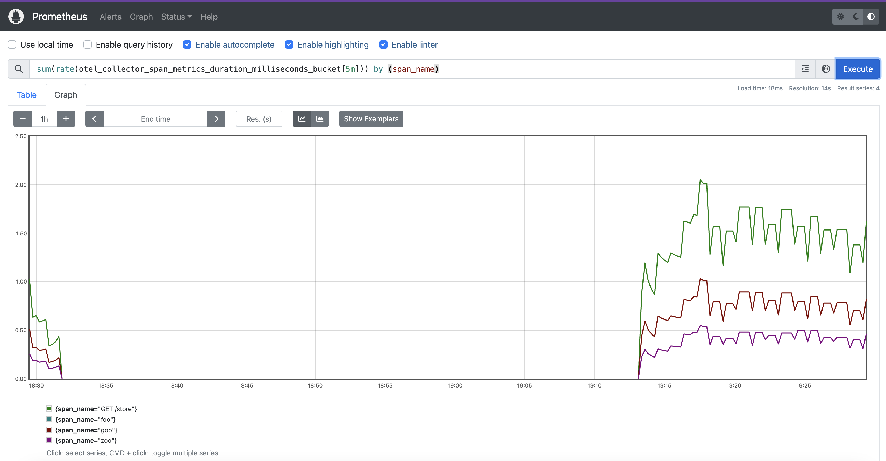

---

### **2. Traffic**

**Definition:** The total **request volume** your system processes over time. Traffic helps identify usage patterns and potential scalability requirements.

**Receive Traffic:**

```promql
sum(rate(container_network_receive_bytes_total[5m])) by (container_label_k8s_app)
```

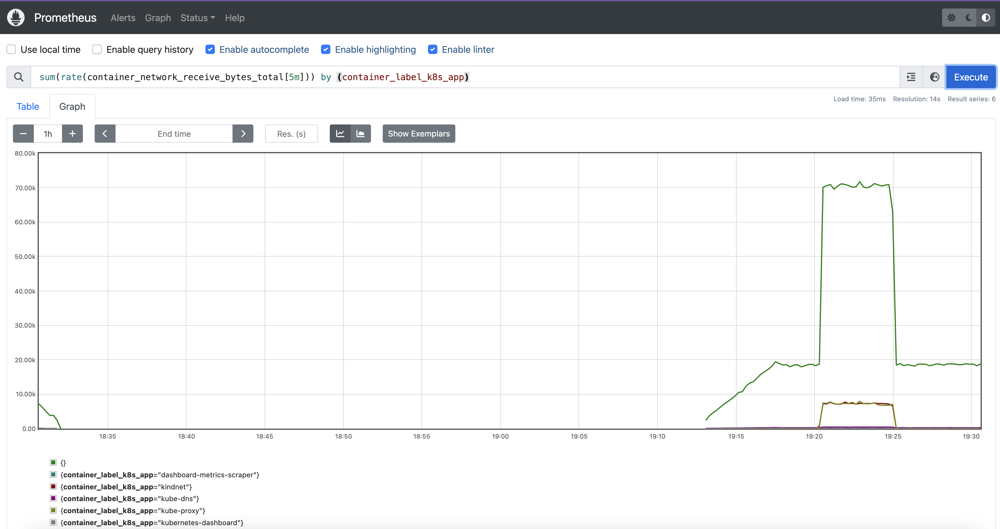

**Transmit Traffic:**

```promql
sum(rate(container_network_transmit_bytes_total[5m])) by (container_label_k8s_app)
```

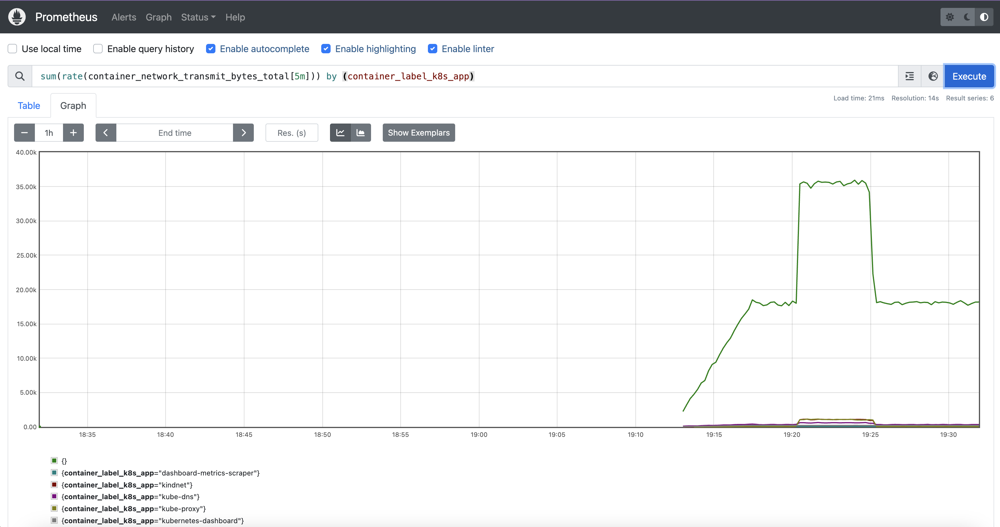

**Receive Errors:**

```promql
sum(rate(container_network_receive_errors_total[5m])) by (container_label_k8s_app)
```


**Transmit Errors:**

```promql
sum(rate(container_network_transmit_errors_total[5m])) by (container_label_k8s_app)
```

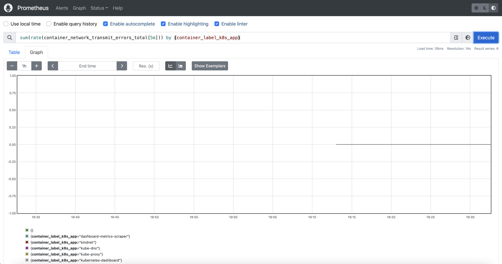

---

### **3. Errors**

**Definition:** The rate of **failed requests** in the system. This includes HTTP errors (e.g., `5xx` codes) and **application-level failures**. High error rates indicate **instability** and may require immediate attention.

**Container Scrape Errors:**

```promql
sum(rate(container_scrape_error[5m])) by (job)
```

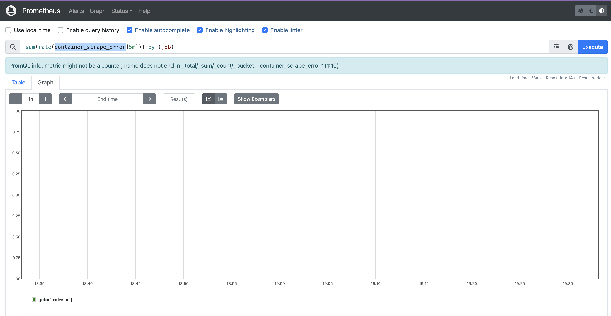

**Application Log Errors:**

```logql
{service_name="unknown_service"} |= "err"
```

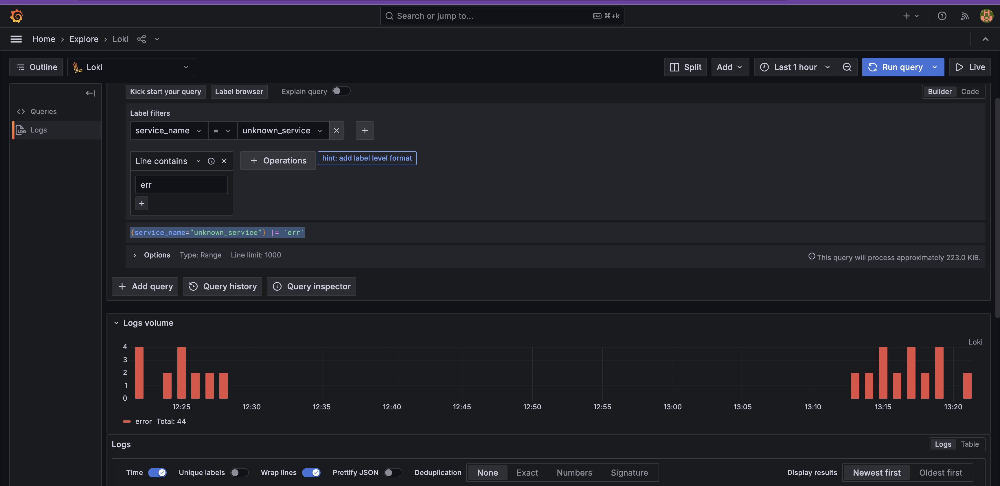

---

### **4. Saturation**

**Definition:** The **resource utilization** of the system. This includes CPU, memory, and disk usage. **High saturation levels** indicate potential performance bottlenecks.

**CPU Usage:**

```promql
sum(rate(container_cpu_usage_seconds_total[5m])) by (container_name, pod_name)
```

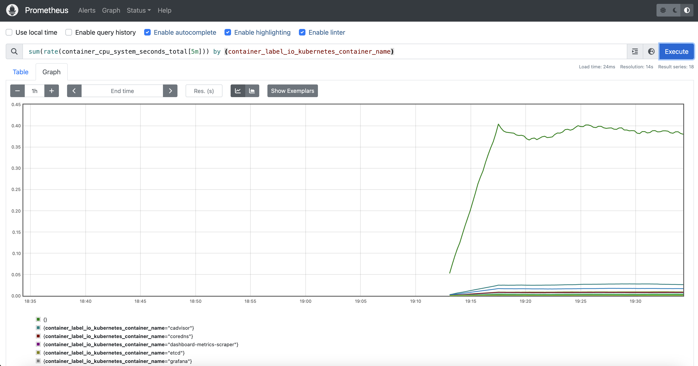

**Memory Usage:**

```promql
count by (container_name) (container_memory_usage_bytes{container_name!="POD",container_name!=""})
```

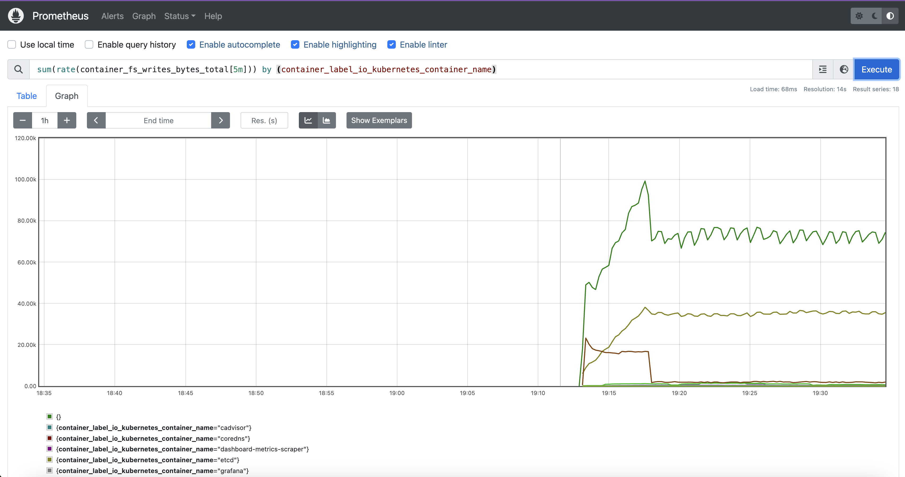

---

## **Deployment**

To deploy the environment for this exercise, run the following:

```bash
./cluster.sh
```

This script automates the entire setup, including:

* Verifying dependencies (`colima`, `minikube`, `kubectl`)
* Cleaning up existing environments
* Building the Docker image
* Starting Minikube via Colima
* Applying manifests:

  * `otel-collector.yaml`
  * `grafana.yaml`
  * `prometheus.yaml`
  * `deployment.yaml`
  * plus Jaeger, Loki, and volume setup

Grafana and Prometheus UIs will open automatically in your browser once the deployment completes.

---

## **Troubleshooting Prometheus Targets**

After deployment, ensure all Prometheus targets are healthy.

```bash
kubectl port-forward -n monitoring svc/prometheus-service 9090:9090 &
sleep 3
curl -s http://localhost:9090/api/v1/targets | jq '.data.activeTargets[] | {job: .labels.job, health: .health, lastError: .lastError}'
```

### **Expected Healthy Targets**

* `prometheus`
* `kubernetes-cadvisor`
* `otel-collector`
* `kubernetes-pods`
* `kubernetes-services`

### **Common Issues & Fixes**

**DNS Resolution Errors (`server misbehaving`):**

* Likely due to incorrect relabeling.
* Check `__meta_kubernetes_pod_ip`.

**HTTP 404 Errors:**

* Normal for endpoints that expose no `/metrics`.

**Connection Refused:**

* Service may not be running.
* Check port configuration.

### **More Diagnostic Commands**

```bash
# View only failing targets
curl -s http://localhost:9090/api/v1/targets | jq '.data.activeTargets[] | select(.health == "down") | {job: .labels.job, instance: .labels.instance, error: .lastError}'

# Get target health summary
curl -s http://localhost:9090/api/v1/targets | jq '.data.activeTargets | {total: length, up: map(select(.health == "up")) | length, down: map(select(.health == "down")) | length}'

# Show available container metrics
curl -s http://localhost:9090/api/v1/label/__name__/values | jq '.data[] | select(test("container_"))'
```

---

## **Final Objective**

At this point, you should now have a complete **Golden Signals dashboard** in Grafana with all panels fully functional.

> These signals provide a holistic view of your system’s health, enabling early detection of failures and resource issues.

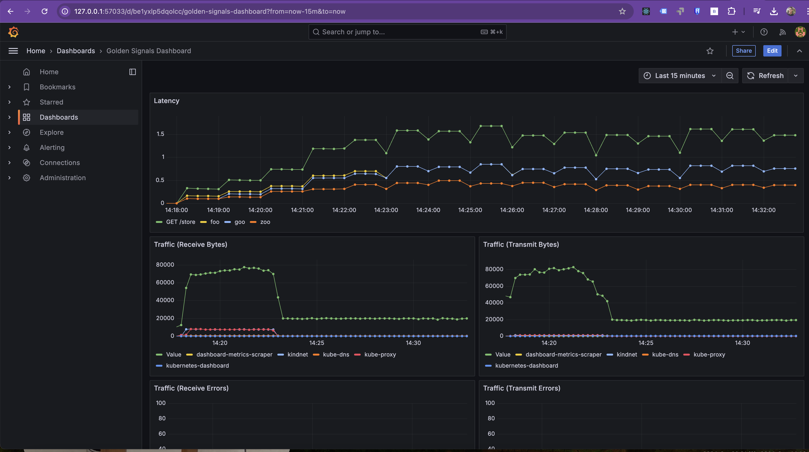
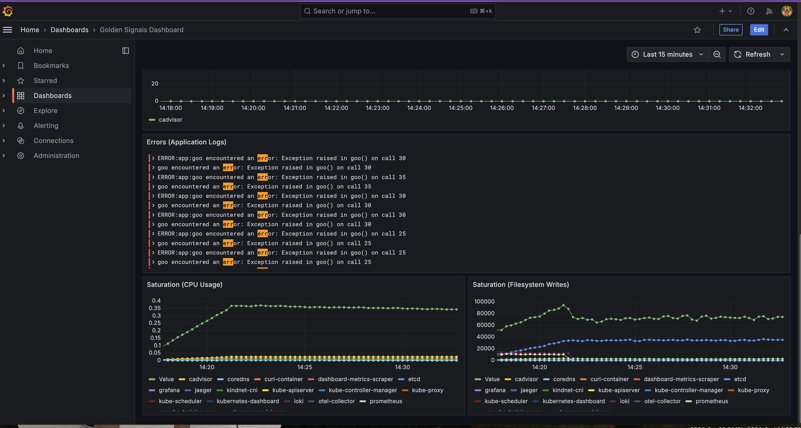

---

## **Next Steps**

In [Exercise 12](../exercise12), you will focus on **alerting in Grafana**, combining **log-based alerts** using Loki and **metrics-based alerts** using Prometheus. This step builds on the observability pipeline you've set up, helping you detect issues like increased latency or application errors in real-time.

You should now be confident with:

* Deploying a complete observability stack using Prometheus, Grafana, Loki, and OpenTelemetry Collector.
* Understanding how spans and metrics are collected and visualized.
* Automating environment provisioning using a deployment script.
* Validating metrics in Prometheus and visualizing span-related data in Grafana dashboards.
* Using both **PromQL** (Prometheus Query Language) for metrics and **LogQL** for log analysis.

---