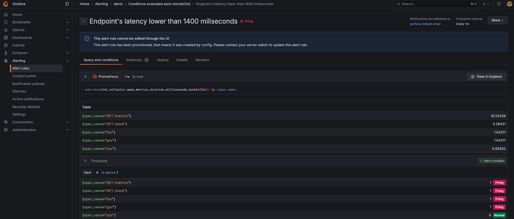
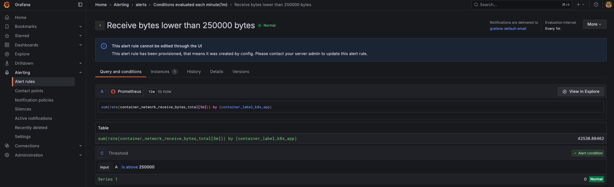
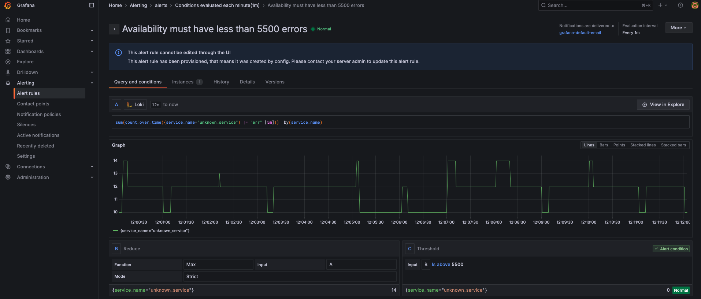

# **Alerting with Grafana: Monitoring Latency and Errors**

## **Table of Contents**

* [Overview](#overview)
* [Understanding the Alerting Setup](#understanding-the-alerting-setup)

  * [Auto-Provisioned Alert Rules](#auto-provisioned-alert-rules)
  * [Auto-Generated Dashboard](#auto-generated-dashboard)
* [Behind the Scenes: YAML Snippets](#behind-the-scenes-yaml-snippets)

  * [Prometheus Rule Example](#prometheus-rule-example)
  * [Grafana Alerts Configuration Snippet](#grafana-alerts-configuration-snippet)
* [Loki Configuration for Alerting](#loki-configuration-for-alerting)
* [Creating Alerts in Grafana (Instructor Reference)](#creating-alerts-in-grafana-instructor-reference)

  * [2. Creating an Alert for the Latency Panel](#2-creating-an-alert-for-the-latency-panel)
  * [3. Creating Additional Alerts Based on SLOs](#3-creating-additional-alerts-based-on-slos)
* [Important Note for Students](#important-note-for-students)
* [Navigate to the Directory](#navigate-to-the-directory)
* [Deployment](#deployment)
* [Final Objective](#final-objective)
* [Next Steps](#next-steps)

---

## **Overview**

This exercise introduces the **alerting layer** of the observability stack, completing the monitoring pipeline with **real-time alert evaluation** using **Grafana**, **Prometheus**, and **Loki**.

Students will NOT configure alerts manually. Instead, alerts are **automatically provisioned** when the environment is deployed. The focus is to understand how alerts are defined in YAML and evaluated inside Grafana.

This aligns with real-world SRE practices where alerts are codified and managed via infrastructure-as-code rather than manual UI actions.

  

---

## **Understanding the Alerting Setup**

### **Auto-Provisioned Alert Rules**

Alerts are defined in a JSON structure stored in a ConfigMap and mounted into Grafana. These rules are visible in the Grafana UI under **Alert rules**, but you don’t need to create or modify them.

They’re evaluated automatically by Grafana.

---

### **Auto-Generated Dashboard**

The dashboard includes panels for:

* Latency
* Traffic (receive/transmit)
* Application logs (Loki)
* CPU and saturation metrics

This dashboard is generated via `grafana-dashboards-config`, and is designed to visually surface the Golden Signals in real-time.

---

## **Behind the Scenes: YAML Snippets**

### **Prometheus Rule Example**

Defined in `prometheus.yaml` under:

```yaml
rule_files:
  - "/etc/prometheus/rules/*.rules"
```

This tells Prometheus to look for rule files (mounted via ConfigMap) for alert evaluation. These rules evaluate traffic and latency.

---

### **Grafana Alerts Configuration Snippet**

From the `grafana-alerts-config` ConfigMap:

```json
{
  "title": "Endpoint's latency lower than 1400 miliseconds",
  "data": [
    {
      "refId": "A",
      "expr": "sum(rate(otel_collector_span_metrics_duration_milliseconds_bucket[5m])) by (span_name)"
    },
    {
      "refId": "C",
      "expression": "A",
      "type": "threshold",
      "conditions": [
        {
          "evaluator": {
            "type": "gt",
            "params": [1400]
          }
        }
      ]
    }
  ]
}
```

This shows that alerts are evaluated based on PromQL expressions, with thresholds coded into the JSON.

---

## **Loki Configuration for Alerting**

Loki is a **log aggregation system** that enables **efficient querying and alerting based on log data**.
It integrates with **Grafana** to trigger alerts when log patterns match predefined rules.

🔹 **Why use Loki for alerting?**
Unlike Prometheus, which focuses on **metrics**, Loki is optimized for **log-based alerts**. This is useful when monitoring **application logs for errors, anomalies, or service degradations**.

### **1. Configuring Loki for Alerting**

To enable alerting in Loki, update its configuration to include **ruler settings**:

```yaml
ruler:
  storage:
    type: local
    local:
      directory: /loki/rules
  rule_path: /tmp/rules/fake/
  alertmanager_url: http://localhost:9093
  ring:
    kvstore:
      store: inmemory
  enable_api: true
```

📌 **Explanation of settings**:

* **`ruler`** → Enables Loki's alerting functionality.
* **`storage.local.directory`** → Defines where alerting rules are stored.
* **`alertmanager_url`** → Sends alerts to **Alertmanager**, which handles notifications.
* **`enable_api`** → Allows managing alerting rules via the Loki API.

> 💡 This is already configured via the `grafana-loki.yaml` file, so no manual changes are needed.

---

## **Creating Alerts in Grafana (Instructor Reference)**

> ⚠️ The following section is for **instructors only**. Students **should not** create alerts manually.
> It exists to help instructors explain what happens behind the scenes when `cluster.sh` provisions alert rules.

Grafana alerts notify users when **metrics exceed defined thresholds**. Below is an example of configuring alerts for latency and error rate.

### **2. Creating an Alert for the Latency Panel**

1. **Open the Latency Panel**:

   * In **Grafana**, navigate to the **Latency panel**.

2. **Edit the Panel**:

   * Click on the panel title → **Edit**.

3. **Go to the Alerts Tab**:

   * Switch to the **Alerts** tab in the panel editor.

4. **Define the Alert Condition**:

```promql
sum(rate(otel_collector_span_metrics_duration_milliseconds_bucket[5m])) by (span_name)
```

5. **Configure the condition**:

   * Evaluate if latency is above **1,400 ms** over the last 10 minutes.

6. **Set evaluation interval and contact point**:

   * Default channel is `grafana-default-email`.

7. **Save and apply**

---

### **3. Creating Additional Alerts Based on SLOs**

These alerts are already defined and auto-provisioned. Still, here's what they look like:

🔹 **Alert 1: High Latency**

```promql
sum(rate(otel_collector_span_metrics_duration_milliseconds_bucket[5m])) by (span_name)
```

📌 Trigger if latency > 1,400 ms



*Grafana alert rule using Prometheus metrics to monitor span latency.*

🔹 **Alert 2: Low Network Traffic**

```promql
sum(rate(container_network_receive_bytes_total[5m])) by (container_label_k8s_app)
```

📌 Trigger if traffic < 250,000 bytes



*Grafana alert rule tracking low inbound network traffic using Prometheus.*

🔹 **Alert 3: High Error Rate**

```promql
sum(count_over_time({service_name="unknown_service"} |= "err" [5m])) by (service_name)
```

📌 Trigger if errors > 5,500



*Grafana alert rule evaluating Loki logs for error count exceeding 5,500.*

---

## **Important Note for Students**

> ⚠️ Do **not** attempt to create or edit alerts manually in Grafana. Everything has already been configured via YAML and provisioned by the script.
>
> This is intentional — to teach **infrastructure-as-code** alerting and reduce human error in real-world deployments.

Instructors will walk through the YAML files during the session to explain how the alerting pipeline works.

---

## **Navigate to the Directory**

Before starting, navigate to the working directory for this exercise:

```bash
cd sre-academy-training/exercises/exercise12
```

---

## **Deployment**

Run the following script to deploy the environment:

```bash
./cluster.sh
```

This will:

* Launch Colima and Minikube.
* Deploy the sample Python application.
* Install Prometheus, Grafana, Loki, and OpenTelemetry Collector.
* Provision Grafana dashboards and alert rules automatically.

After running `cluster.sh`, a dashboard named **Alerts** is created inside Grafana with pre-configured alert rules.

Go to the Grafana UI then navigate to:

**Home > Dashboards > Alerts > Alert rules**

You will find three pre-provisioned alert rules:

| Alert Name              | Description                          | Threshold                |
| ----------------------- | ------------------------------------ | ------------------------ |
| **High Error Rate**     | Error count exceeds availability SLO | > 5,500 errors           |
| **High Latency**        | Endpoint latency too high            | > 1,400 milliseconds     |
| **Low Network Traffic** | Network input traffic dropped        | < 250,000 bytes received |

These alerts simulate production-level thresholds tied to app metrics and logs.

---

## **Final Objective**

At the end of this exercise, you should be able to:

✅ Identify key alert thresholds and where they are defined.
✅ Navigate to pre-configured alert rules in Grafana.
✅ Understand how infrastructure-as-code defines alerts using ConfigMaps and JSON.
✅ Interpret how alerts fit into SRE monitoring and reliability workflows.

This completes your exposure to all four pillars of observability: **Logs, Metrics, Traces, and Alerts.**

---

## **Next Steps**

In [Exercise 13](../exercise13), we’ll shift focus from alerting to **automating incident response**. You’ll learn how to use **AWX** to trigger runbooks automatically when alerts fire in Grafana.

You should now be confident with:

* Understanding how metrics and logs trigger alerts.
* Viewing and interpreting alert rules in the Grafana UI.
* Connecting YAML-based alert rules to observable dashboards.
* Trusting the full observability pipeline: **Logs + Metrics + Alerts**.

---