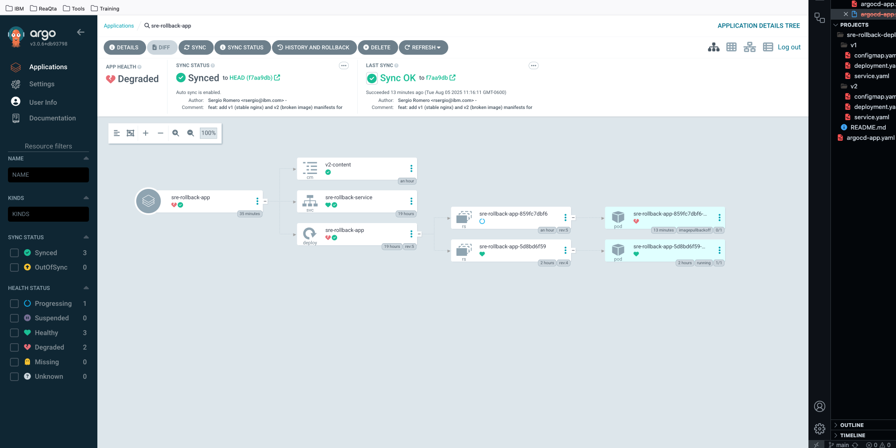
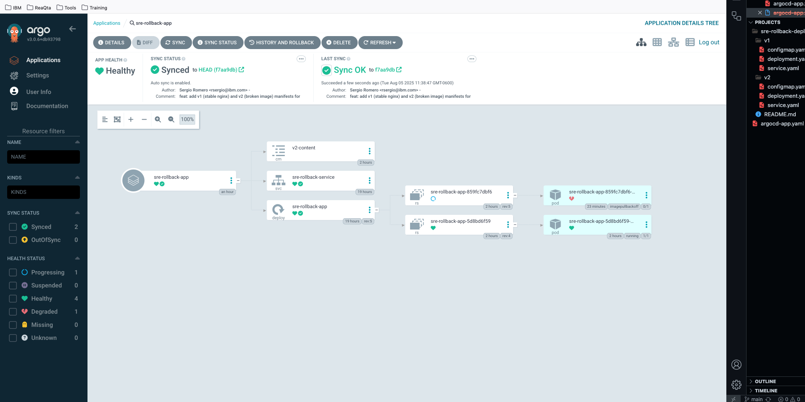

# Rolling Updates & Rollbacks in Kubernetes

## Table of Contents

- [Scenario: A Bad Release in Production](#scenario-a-bad-release-in-production)
- [Why Rollbacks Matter for SRE](#why-rollbacks-matter-for-sre)
- [Learning Objectives](#learning-objectives)
- [Prerequisites and GitHub Repo Preparation](#prerequisites-and-github-repo-preparation)
- [Cleanup](#cleanup)
- [Phase 1: Prepare Versioned Manifests](#phase-1-prepare-versioned-manifests)
- [Phase 2: Deploy & Verify v1 (Stable)](#phase-2-deploy--verify-v1-stable)
- [Phase 3: Simulate Faulty v2 Release](#phase-3-simulate-faulty-v2-release)
- [Phase 4: Kubernetes-Native Rollback](#phase-4-kubernetes-native-rollback)
- [Phase 5: ArgoCD-Driven Rollback](#phase-5-argocd-driven-rollback)
- [ArgoCD Rollback Methods](#argocd-rollback-methods)
- [Verify the Rollback](#verify-the-rollback)
- [Expected Outcome](#expected-outcome)
- [Next Steps](#next-steps)

---

## Scenario: A Bad Release in Production

Your team has just pushed v2.0 of the "sre-rollback-app" into production. Shortly after, alerts flood in: pods crash, the service returns errors, and users can't reach your app. As the on-call SRE, you need to revert to the last known-good version (v1.0) as quickly as possible.

**🚨 The clock is ticking: every minute of downtime costs your company money and damages user trust!**

---

## Why Rollbacks Matter for SRE

In a production environment, every second of downtime directly impacts your users and your business's bottom line. When a new release introduces an unexpected regression—or worse, a total outage—your first priority is to restore service as quickly as possible. Rollbacks provide a proven safety valve: instead of scrambling to diagnose and patch on the fly, you can revert to the last known-good configuration with a single command.

By automating rollbacks through Kubernetes' native `rollout undo` or through a GitOps control plane like ArgoCD, you eliminate error-prone manual steps, enforce consistency, and reduce human intervention to near zero. This not only speeds up recovery but also ensures that every change—and every reversion—is recorded in your cluster's deployment history and in Git. Together, those audit trails offer complete visibility into who changed what, when, and why.

From an SRE metrics perspective, fast and reliable rollbacks drive down **Mean Time To Recovery (MTTR)**—an SRE golden metric—helping you meet aggressive SLAs (for many teams, MTTR targets are under five minutes). Quick reversion also protects your **error budget** by minimizing how much downtime eats into your allotted margin of failure. And by bounding the impact of a bad release (your "blast radius"), rollbacks preserve user trust and keep postmortems focused and data-driven: you can pinpoint exactly when and how the system diverged from its healthy state.

---

## Learning Objectives

In this exercise you will author and manage two distinct application versions—a stable v1 release and an intentionally broken v2—to practice full rollback workflows. You'll begin by writing versioned Kubernetes manifests and deploying the stable release, verifying its health both at the pod level and through service endpoints. Next, you will introduce a failure by rolling out the broken version, then gather diagnostic data from pod logs, events, and rollout status.

With a clear understanding of the failure, you will execute a native Kubernetes rollback using `kubectl rollout undo`, observing how the cluster automatically restores the previous deployment. You will then repeat that recovery through ArgoCD's GitOps model—rolling back declaratively in the UI and via the `argocd` CLI—reinforcing the differences between imperative and declarative incident response.

Throughout the lab, you will inspect rollout history, monitor events and logs, and watch your service return to a healthy state in real time. By the end, you'll not only have hands-on experience with both manual and automated rollback techniques, but also an intuitive grasp of how these patterns drive down MTTR, preserve error budgets, and underpin resilient SRE practices.

---

## Prerequisites and GitHub Repo Preparation

**Make sure you've completed Exercise 17** (ArgoCD) and have:

- A running Minikube/Colima cluster  
- `kubectl` pointing at that cluster  
- ArgoCD installed, with `kubectl port-forward svc/argocd-server -n argocd 8080:443 &` running  
- `argocd` CLI installed and logged in:  

  ```bash
  argocd login localhost:8080 \
    --username admin \
    --password "$(kubectl -n argocd get secret argocd-initial-admin-secret \
      -o jsonpath="{.data.password}" | base64 --decode)" \
    --insecure
  ```

### **Verify Your Prerequisites**

```bash
# Check kubectl client version
kubectl version --client

# Check cluster connectivity by listing nodes
kubectl version          # you'll see both Client and Server versions
kubectl get nodes

# Verify ArgoCD server pod is running
kubectl get pods -n argocd | grep argocd-server

# Test ArgoCD CLI connection
argocd version --client   # checks your CLI version
argocd version            # shows both CLI and server versions
```

### 1. Create Your Personal GitHub Repo

1. Visit [https://github.com/new](https://github.com/new)
2. **Name:** `sre-rollback-deployments`
3. **Visibility:** Public
4. **Leave "Initialize this repository with a README" unchecked**
5. Click **Create repository**

### 2. Bootstrap Locally

Create & enter your workspace:

```bash
mkdir -p ~/Projects/sre-rollback-deployments
cd ~/Projects/sre-rollback-deployments

# Initialize Git repository
git init
git branch -M main
```

Link to your remote:

```bash
git remote add origin https://github.com/YOUR-USERNAME/sre-rollback-deployments.git
```

*Replace `YOUR-USERNAME` with your GitHub username.*

Create initial commit and push:

```bash
# Create initial README
echo "# SRE Rollback Deployments Lab" > README.md
git add README.md
git commit -m "feat: initial commit with lab setup"
git push -u origin main
```

*Sets upstream so future pushes/pulls are simple.*

> ❗ **If you see `rejected: fetch first`**, then the remote already has commits; integrate with:
>
> ```bash
> git pull --rebase origin main
> git push origin main
> ```

---

## Cleanup

Before you start this exercise, remove any leftover demo resources:

```bash
# Remove ArgoCD applications (ignore if they don't exist)
kubectl delete application sre-app sre-app-dev sre-app-staging sre-app-prod \
  -n argocd --ignore-not-found

# Delete demo namespaces
kubectl delete namespace application dev staging production \
  --ignore-not-found

# Wipe any orphaned sre-demo deployments/services
for ns in application dev staging production; do
  kubectl delete deployment,service -n "$ns" --all --ignore-not-found
done

# Confirm no leftover sre-demo pods or services
kubectl get pods -A | grep sre-demo
```

---

## Phase 1: Prepare Versioned Manifests

We'll create two folders—`v1/` (stable) and `v2/` (faulty)—each with a Deployment, Service, and ConfigMap. This simulates how teams manage different versions of their applications using reliable public container images.

### **Create Stable Version (v1)**

```bash
# Create directory structure
mkdir -p v1
```

```bash
# Stable v1 deployment using nginx
cat > v1/deployment.yaml <<EOF
apiVersion: apps/v1
kind: Deployment
metadata:
  name: sre-rollback-app
  labels:
    app: sre-rollback-app
    version: v1
spec:
  replicas: 1
  selector:
    matchLabels: 
      app: sre-rollback-app
  template:
    metadata: 
      labels: 
        app: sre-rollback-app
        version: v1
    spec:
      containers:
      - name: app
        image: nginx:1.21-alpine  # Stable, reliable image
        ports: 
        - containerPort: 80
        # Health checks for safer deployments
        livenessProbe:
          httpGet:
            path: /
            port: 80
          initialDelaySeconds: 10
          periodSeconds: 10
        readinessProbe:
          httpGet:
            path: /
            port: 80
          initialDelaySeconds: 5
          periodSeconds: 5
        # Mount custom content to differentiate versions
        volumeMounts:
        - name: html-content
          mountPath: /usr/share/nginx/html/index.html
          subPath: index.html
      volumes:
      - name: html-content
        configMap:
          name: v1-content
EOF

# Stable v1 service
cat > v1/service.yaml <<EOF
apiVersion: v1
kind: Service
metadata: 
  name: sre-rollback-service
  labels:
    app: sre-rollback-app
spec:
  selector: 
    app: sre-rollback-app
  ports: 
  - port: 80
    targetPort: 80
  type: NodePort
EOF

# ConfigMap with v1 content
cat > v1/configmap.yaml <<EOF
apiVersion: v1
kind: ConfigMap
metadata:
  name: v1-content
data:
  index.html: |
    <!DOCTYPE html>
    <html>
    <head>
        <title>SRE Rollback Demo v1</title>
        <style>
            body { font-family: Arial, sans-serif; text-align: center; padding: 50px; background: #f0f8ff; }
            .version { color: #28a745; font-size: 2em; margin: 20px 0; }
            .status { color: #155724; background: #d4edda; padding: 15px; border-radius: 5px; display: inline-block; }
        </style>
    </head>
    <body>
        <h1>SRE Rollback Demo</h1>
        <div class="version">✅ Version 1.0 - Stable Release</div>
        <div class="status">
            <strong>Status:</strong> Healthy and Running<br>
            <strong>Deployed:</strong> <span id="timestamp"></span>
        </div>
        <p>This is the stable version that works correctly and passes all health checks.</p>
        <script>
            document.getElementById('timestamp').textContent = new Date().toLocaleString();
        </script>
    </body>
    </html>
EOF
```

### **Create Faulty Version (v2)**

```bash
# Create directory for faulty version
mkdir -p v2
```

```bash
# Faulty v2 deployment (intentionally broken with non-existent image)
cat > v2/deployment.yaml <<EOF
apiVersion: apps/v1
kind: Deployment
metadata:
  name: sre-rollback-app
  labels:
    app: sre-rollback-app
    version: v2
spec:
  replicas: 1
  selector:
    matchLabels: 
      app: sre-rollback-app
  template:
    metadata: 
      labels: 
        app: sre-rollback-app
        version: v2
    spec:
      containers:
      - name: app
        image: nginx:broken-v2-tag  # This image tag doesn't exist - causes ImagePullBackOff
        ports: 
        - containerPort: 80
        # Same health checks as v1 (but won't work due to broken image)
        livenessProbe:
          httpGet:
            path: /
            port: 80
          initialDelaySeconds: 10
          periodSeconds: 10
        readinessProbe:
          httpGet:
            path: /
            port: 80
          initialDelaySeconds: 5
          periodSeconds: 5
        volumeMounts:
        - name: html-content
          mountPath: /usr/share/nginx/html/index.html
          subPath: index.html
      volumes:
      - name: html-content
        configMap:
          name: v2-content
EOF

# Same service configuration for v2
cat > v2/service.yaml <<EOF
apiVersion: v1
kind: Service
metadata: 
  name: sre-rollback-service
  labels:
    app: sre-rollback-app
spec:
  selector: 
    app: sre-rollback-app
  ports: 
  - port: 80
    targetPort: 80
  type: NodePort
EOF

# ConfigMap for v2 (won't be used due to broken image, but shows intent)
cat > v2/configmap.yaml <<EOF
apiVersion: v1
kind: ConfigMap
metadata:
  name: v2-content
data:
  index.html: |
    <!DOCTYPE html>
    <html>
    <head>
        <title>SRE Rollback Demo v2</title>
        <style>
            body { font-family: Arial, sans-serif; text-align: center; padding: 50px; background: #ffe6e6; }
            .version { color: #dc3545; font-size: 2em; margin: 20px 0; }
            .status { color: #721c24; background: #f8d7da; padding: 15px; border-radius: 5px; display: inline-block; }
        </style>
    </head>
    <body>
        <h1>SRE Rollback Demo</h1>
        <div class="version">❌ Version 2.0 - Broken Release</div>
        <div class="status">
            <strong>Status:</strong> Unhealthy - Critical Issues Detected<br>
            <strong>Deployed:</strong> <span id="timestamp"></span>
        </div>
        <p>This version has critical issues and should be rolled back immediately!</p>
        <script>
            document.getElementById('timestamp').textContent = new Date().toLocaleString();
        </script>
    </body>
    </html>
EOF
```

```bash
# Stage your new version folders
git add v1 v2

# Commit with a clear, descriptive message
git commit -m "feat: add v1 (stable nginx) and v2 (broken image) manifests for rollback demo"

# Push to your GitHub remote
git push origin main
```

---

## Phase 2: Deploy & Verify v1 (Stable)

**Why?** Establish a known-good baseline before simulating failure.

### **Deploy the Stable Version**

```bash
# Apply v1 manifests (includes deployment, service, and configmap)
kubectl apply -f v1/

# Monitor deployment progress
kubectl rollout status deployment/sre-rollback-app
# Expected output: "deployment "sre-rollback-app" successfully rolled out"
```

## Verify Deployment Health and Accessibility

Start by confirming that your application pod is up and running, and that the ConfigMap mounted correctly:

```bash
# List pods for sre-rollback-app and verify a single pod is in Running state
kubectl get pods -l app=sre-rollback-app

# For more detail on where it’s running and its start time
kubectl get pods -l app=sre-rollback-app -o wide

# Inspect the Deployment to see its replicas, conditions, and rollout status
kubectl describe deployment sre-rollback-app

# Make sure your v1 ConfigMap exists
kubectl get configmap v1-content
```

Next, open a local tunnel into your Service so you can exercise the application directly from your workstation:

```bash
# Forward port 8081 on your machine to port 80 of the Kubernetes Service,
# listening on all interfaces so you can curl or browse to it.
kubectl port-forward svc/sre-rollback-service 8081:80 --address 0.0.0.0 &

# Define a variable for convenience
SERVICE_URL=http://localhost:8081

# Print the URL you’ll use
echo "Service is available at ${SERVICE_URL}"
```

With the tunnel in place, check for any recent errors and verify that nginx is serving your custom v1 page:

```bash
# Show the last few events in the cluster to confirm there are no errors
kubectl get events --sort-by='.metadata.creationTimestamp' | tail -5

# Fetch the first ten lines of the HTML response to confirm Version 1.0 content
curl -s "${SERVICE_URL}" | head -10
```

---

## Phase 3: Simulate Faulty v2 Release

In this phase, you’ll push the broken manifests from `v2`, observe the failure symptoms as Kubernetes tries and fails to pull the invalid image, and gather the key diagnostic outputs you’d use in a real incident.

First, apply the `v2` folder and attempt to monitor the rollout. You should see the command time out or report an error when Kubernetes can’t fetch the image:

```bash
# Deploy the faulty version and watch for rollout failure
kubectl apply -f v2/

echo "Deploying v2 (expected to fail)..."
kubectl rollout status deployment/sre-rollback-app --timeout=60s \
  || echo "Deployment did not complete, as expected for the broken image"
```

Next, inspect the live failure in three parts:

1. **Pod status over time**
   Open a terminal and run:

   ```bash
   watch -n 2 'kubectl get pods -l app=sre-rollback-app'
   ```

   You will see one or more pods stuck in `ImagePullBackOff` or `ErrImagePull`.

2. **Details on the failing pod**
   In a second window, capture the name of the most recently created pod and describe it to view the image pull errors:

   ```bash
   FAILING_POD=$(kubectl get pods -l app=sre-rollback-app \
     --sort-by='.metadata.creationTimestamp' \
     -o jsonpath='{.items[-1].metadata.name}')

   echo "Describing pod: $FAILING_POD"
   kubectl describe pod "$FAILING_POD"

   # Inspect related events for this pod
   kubectl get events \
     --field-selector involvedObject.name="$FAILING_POD" \
     --sort-by='.metadata.creationTimestamp'
   ```

### Service availability check

Open a shell (the same one where you ran the port-forward, or after you’ve exported the URL) and run:

```bash
# Continuously probe the service every 3 seconds
export SERVICE_URL="http://localhost:8081"
while sleep 3; do
  HTTP_CODE=$(curl -s -o /dev/null -w "%{http_code}" "$SERVICE_URL" || echo "000")
  echo "$(date '+%H:%M:%S') → HTTP ${HTTP_CODE}"
done

# Sample output:
# 10:07:54 → HTTP 200
# 10:07:57 → HTTP 200
# 10:08:00 → HTTP 200
# …
```

At each timestamp you should see HTTP 200. That confirms your v1 pod is healthy and serving traffic continuously—exactly the behavior you want before proceeding to simulate the faulty release.


**What this does:**

* Exports `SERVICE_URL` so it’s available in your loop.
* Uses `curl` in silent mode to fetch only the HTTP status code.
* Falls back to `000` if the connection fails.
* Prints a timestamp plus the code, so you can see exactly when the service dropped or recovered.

That way, you won’t run into a blank‐URL error, and you get a clear, time-stamped view of service availability as you trigger and roll back your v2 release.

Finally, pull together cluster-wide diagnostics to confirm the root cause and scope of the failure:

```bash
# Review Deployment conditions and rollout history
kubectl describe deployment sre-rollback-app

# Show the last ten events in the cluster
kubectl get events --sort-by='.metadata.creationTimestamp' | tail -10

# List ReplicaSets to see both v1 and the attempted v2 rollout
kubectl get rs -l app=sre-rollback-app -o wide

# Check the rollout status one more time
kubectl rollout status deployment/sre-rollback-app --timeout=10s \
  || echo "Rollout remains incomplete"

# Print the image reference that triggered the failure
kubectl get deployment sre-rollback-app \
  -o jsonpath='{.spec.template.spec.containers[0].image}'; echo
```

By now you will have observed pods repeatedly failing to pull the broken image, seen error events like “Error: ImagePullBackOff” or “Back-off pulling image "nginx:broken-v2-tag” and noted that your deployment reports one unavailable replica.

With that context, you’re ready to execute an emergency rollback in Phase 4.

---

## Phase 4: Kubernetes Native Rollback

When you applied the faulty v2 manifests, Kubernetes began spinning up new pods that immediately entered `ImagePullBackOff`. Because the rolling-update strategy keeps old pods alive until new ones become Ready, your service at `http://localhost:8081` may continue to return HTTP 200 even though no healthy v2 replicas exist. To reconcile your Deployment’s desired state and remove the broken ReplicaSet, perform a native rollback.

```bash
# Trigger the rollback to the last-known-good revision
echo "Rolling back to v1..."
kubectl rollout undo deployment/sre-rollback-app

# Wait (up to 3 minutes) for the rollout to complete
kubectl rollout status deployment/sre-rollback-app --timeout=180s
```

Once you see the “successfully rolled out” message, confirm that Kubernetes has torn down the failing v2 pods and brought up fresh v1 pods. In one shell, run:

```bash
watch -n 2 'kubectl get pods -l app=sre-rollback-app'
```

You should observe the old v2 pods disappearing and new v1 pods entering the Running state.

Meanwhile, in another shell, verify that your application is serving the correct v1 content and health status:

```bash
export SERVICE_URL="http://localhost:8081"

for attempt in $(seq 1 10); do
  TS=$(date '+%H:%M:%S')
  HTTP_CODE=$(curl -s -o /dev/null -w "%{http_code}" "$SERVICE_URL" || echo "000")
  VERSION=$(curl -s "$SERVICE_URL" | grep -oE "Version [0-9.]*" || echo "no version tag")
  STATUS=$(curl -s "$SERVICE_URL" | grep -oE "Status: [A-Za-z ]*"   || echo "no status tag")
  echo "[$TS] HTTP $HTTP_CODE — ${VERSION} | ${STATUS}"
  sleep 2
done

# Sample output:
# [10:45:00] HTTP 200 — Version 1.0 | Status: Healthy and Running
# [10:45:02] HTTP 200 — Version 1.0 | Status: Healthy and Running
```

Seeing HTTP 200 alongside “Version 1.0” and “Status: Healthy and Running” confirms that the rollback succeeded: the broken v2 pods are gone, the Deployment spec has reverted to nginx:1.21-alpine, and your service is serving the expected content.

Finally, perform a brief audit to ensure everything matches v1:

```bash
# List pods and verify they all use the v1 image
kubectl get pods -l app=sre-rollback-app -o wide

# Describe the Deployment to inspect its current conditions
kubectl describe deployment sre-rollback-app

# Confirm the live container image is nginx:1.21-alpine
kubectl get deployment sre-rollback-app \
  -o jsonpath='{.spec.template.spec.containers[0].image}'; echo

# Review rollout history
kubectl rollout history deployment/sre-rollback-app

# Inspect a specific revision by number, e.g. revision 3 or 4:
kubectl rollout history deployment/sre-rollback-app --revision=3

# Verify that only the v1 ConfigMap is actively mounted
kubectl get deployment sre-rollback-app -o yaml | grep -A4 "configMap:"

# List all ConfigMaps to confirm v2-content remains but is unused
kubectl get configmaps
```

At this stage, your cluster state, service behavior, and rollout history all reflect the stable v1 release. You’re now ready to proceed to Phase 5 for a GitOps-driven rollback using ArgoCD.

---

## Phase 5: ArgoCD-Driven Rollback

**Why?** Practice GitOps-based recovery for declarative infrastructure management.

### **Create ArgoCD Application**

First, let's create an ArgoCD application that syncs with our GitHub repository:

> Replace YOUR-USERNAME with your actual GitHub username

```bash
# Create ArgoCD application manifest
cat > argocd-app.yaml <<EOF
apiVersion: argoproj.io/v1alpha1
kind: Application
metadata:
  name: sre-rollback-app
  namespace: argocd
spec:
  project: default
  source:
    repoURL: https://github.com/YOUR-USERNAME/sre-rollback-deployments.git
    targetRevision: HEAD
    path: v1  # Start with stable version
  destination:
    server: https://kubernetes.default.svc
    namespace: default
  syncPolicy:
    automated:
      prune: true
      selfHeal: true
    syncOptions:
    - CreateNamespace=true
EOF
```

```bash
# Apply the ArgoCD application
kubectl apply -f argocd-app.yaml

# Wait for ArgoCD to sync
echo "Waiting for ArgoCD to sync the application..."
sleep 10
argocd app get sre-rollback-app
```

### **Simulate Failure via GitOps**

#### 1. Retrieve Admin Password

Open a new terminal and with the port-forward running, grab your initial admin password from the secret:
You will use the credentials to log in via CLI and UI. 

```bash
export ARGOCD_PASSWORD=$(
  kubectl -n argocd get secret argocd-initial-admin-secret \
    -o jsonpath="{.data.password}" | base64 --decode
)
echo "ArgoCD Admin Password: $ARGOCD_PASSWORD"
```

#### 2. Log in via the CLI

Authenticate the `argocd` CLI:

```bash
argocd login localhost:8080 \
  --username admin \
  --password "$ARGOCD_PASSWORD" \
  --insecure
```

You can now run `argocd app list` to see your applications, and `argocd app get sre-rollback-app` to view its current status in the CLI.

#### 3. Forward the ArgoCD UI

In one shell, expose the ArgoCD server on localhost:

```bash
kubectl port-forward svc/argocd-server -n argocd 8080:443 &
ARGO_UI_PID=$!
echo "ArgoCD UI available at https://localhost:8080"
# Open in your browser:
#   open https://localhost:8080
```

#### 4. Sync the Faulty Version

Before you apply the patch, open the ArgoCD dashboard.

Now, in your CLI, point ArgoCD at the broken manifests under `v2`:

```bash
kubectl patch application sre-rollback-app -n argocd \
  --type='merge' \
  -p='{"spec":{"source":{"path":"v2"}}}'
```

Immediately initiate a manual sync:

```bash
argocd app sync sre-rollback-app
argocd app wait sre-rollback-app --health --timeout 60
```

After this, go to the UI and you will notice the application card flipping to **OutOfSync** or **Degraded** in the dashboard. Click the **Failed sync** section to inspect which resources (pods, ReplicaSets) could not deploy—this visual confirmation aligns with the pod pull errors you observed in the cluster.

  
*Figure 1: ArgoCD Applications Overview (Synced & Progressing)*

  
*Figure 2: Application Details Tree (v2 in ImagePullBackOff)*

  
*Figure 3: Application Details Tree (Degraded State)*

#### 5. Observe Pod Failures

Meanwhile, in your cluster, you can watch the pods crash:

```bash
kubectl get pods -l app=sre-rollback-app -w
```

Press `Ctrl+C` when you’ve seen enough of the ImagePullBackOff errors.

#### 6. Clean Up

Once you’re ready to rollback in ArgoCD (or move on), stop the port-forward:

```bash
kill $ARGO_UI_PID
```

---

### **ArgoCD Rollback Methods**

You have three ways to roll back your application in ArgoCD. Pick the one that best fits your workflow:

#### Method 1: Git-Based Rollback (Declarative) — Preferred Method

For a pure GitOps approach, revert the ArgoCD Application’s source path back to `v1` and let ArgoCD sync automatically:

```bash
# Patch the Application manifest to use v1 manifests
kubectl patch application sre-rollback-app -n argocd \
  --type='merge' \
  -p='{"spec":{"source":{"path":"v1"}}}'
```

#### Method 2: Rollback via the Web UI

1. **Ensure the UI is accessible**
   In a shell, forward the ArgoCD server and open `https://localhost:8080` in your browser:

   ```bash
   kubectl port-forward svc/argocd-server -n argocd 8080:443 &
   open https://localhost:8080    # macOS
   # xdg-open https://localhost:8080  # Linux
   ```
2. **Perform the rollback**

   * Select **Applications** → **sre-rollback-app**
   * Click the **History and Rollback** tab
   * Choose the last successful (v1) revision and hit **Rollback**
   * Confirm in the dialog

#### Method 3: Rollback via the CLI

If you prefer the terminal, use the `argocd` command-line client:

```bash
# List all revisions
argocd app history sre-rollback-app

# Identify the last v1 revision (adjust the grep if needed)
LAST_V1_REV=$(argocd app history sre-rollback-app \
  | grep v1 \
  | tail -1 \
  | awk '{print $1}')

# Execute the rollback
echo "Rolling back to revision $LAST_V1_REV"
argocd app rollback sre-rollback-app "$LAST_V1_REV"
```

After the sync completes, the application should show a green “Healthy” icon and your fresh v1 pod alongside the broken v2 ReplicaSet:

  
*Figure 4: Application Details Tree (Post-Rollback Healthy State)*

---

### Verify the Rollback

After you roll back by any method, confirm that the application is healthy, running v1, and serving the correct content:

```bash
# 1. Check ArgoCD sync and health status
argocd app get sre-rollback-app

# 2. Verify pods are using the stable image
kubectl get pods -l app=sre-rollback-app -o wide
```

With these steps, you’ll have fully reverted to the stable v1 release in ArgoCD, validated the rollout, and confirmed your service is serving the expected content.

---

## Expected Outcome

By completing this exercise, you will have installed and configured versioned manifests for stability testing, simulated realistic production failures with broken container images, practiced native rollback with kubectl, and embraced GitOps rollbacks through ArgoCD. You’ll have observed rollout history, service availability, and configuration drift from both CLI and UI perspectives.

These skills reinforce core SRE capabilities:

– Rapid incident response using automated rollback patterns.
– Declarative infrastructure management with audit trails.
– Real-time observability during deployment and recovery.
– Scripting against Kubernetes without manual tunnels or background processes.

---

## Next Steps

In **[Exercise 19](../exercise19)**, we will move beyond simple image failures and into the unpredictable world of Chaos Engineering. You'll use tools like Chaos Monkey and Litmus to introduce controlled failures, simulating real-world disruptions such as network partitions, CPU spikes, and memory pressure. By validating your rollback procedures under these stressful conditions, you'll gain confidence that your recovery workflows can handle any type of failure. This systematic approach to testing system resilience will not only expose weaknesses but also allow you to continuously improve your processes. The ultimate goal is to automate these chaos experiments and measure improvements in your Mean Time to Recovery (MTTR), ensuring your systems are resilient and your team is prepared for anything.

The rollback skills you've mastered here will be essential when chaos engineering exposes weaknesses in your systems - you'll know exactly how to recover quickly and safely from any type of failure!

---

**Ready to break things safely and build antifragile systems? Continue to Exercise 19: Chaos Engineering!**
