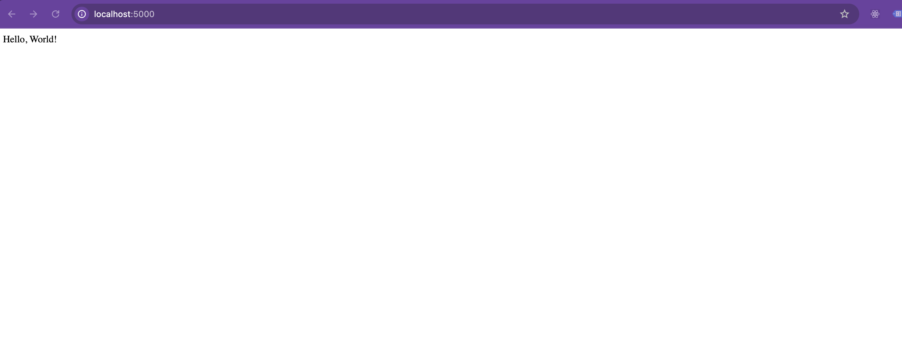

# Pushing a Python Application to Docker Hub with Colima

## Table of Contents

* [Introduction to Docker Hub](#introduction-to-docker-hub)
* [Creating a Docker Hub Account](#creating-a-docker-hub-account)
* [Creating a Docker Repository](#creating-a-docker-repository)
* [Prerequisites](#prerequisites)
* [Start Colima](#start-colima)
* [Navigate to the Application Directory](#navigate-to-the-application-directory)
* [Pushing the Image to Docker Hub](#pushing-the-image-to-docker-hub)

  * [Verify the Local Image](#verify-the-local-image)
  * [Tag the Local Image](#tag-the-local-image)
  * [Push the Image to Docker Hub](#push-the-image-to-docker-hub)
* [Running Remote Images](#running-remote-images)
* [Final Objective](#final-objective)
* [Next Steps](#next-steps)

---

## Introduction to Docker Hub

Docker Hub is a cloud-based registry service where container images can be stored, shared, and managed. It simplifies the process of distributing containerized applications, making it easier for developers to collaborate and deploy.

### Key Features:

* **Image Repositories** (public or private)
* **Automated Builds**
* **Webhooks**
* **Team Access Control**
* **Official Base Images**

---

## Creating a Docker Hub Account

1. Visit [https://hub.docker.com/](https://hub.docker.com/)
2. Click **Sign Up** and follow the instructions.
3. Confirm your email and log in.

---

## Creating a Docker Repository

1. Log in to Docker Hub.
2. Navigate to the **Repositories** tab and click **Create Repository**.
3. Enter a name, set visibility (public/private), and click **Create**.

---

## Prerequisites

Ensure the following tools are installed (refer to the `installation.md` file for setup instructions):

* [Colima](https://github.com/abiosoft/colima)
* [Docker CLI](https://docs.docker.com/get-docker/)
* Python (optional, already covered in Exercise 1)

---

## Start Colima

Colima provides a Linux VM with Docker support on macOS.

Start Colima with Docker runtime:

```bash
colima start --runtime docker
```

This will boot up a Docker daemon ready to be used on your machine without needing Docker Desktop.

---

## Navigate to the Application Directory

Navigate to the folder that contains your Dockerfile and app code:

```bash
cd sre-academy-training/exercises/exercise3
```

---

## Pushing the Image to Docker Hub

### Verify the Local Image

Run the following command to list local images:

```bash
docker images
```

You should see an image named `my-python-app` (created in **Exercise 2**).

---

### Tag the Local Image

Tag the image to match your Docker Hub repository name:

```bash
docker tag my-python-app:latest username/my-python-app:latest
```

Replace `username` with your Docker Hub username.

---

### Push the Image to Docker Hub

1. Login to Docker Hub:

```bash
docker login
```

2. Push the image:

```bash
docker push username/my-python-app:latest
```

Once complete, confirm it on [hub.docker.com](https://hub.docker.com/) under your Repositories tab.

---

## Running Remote Images

To run the pushed image on any other machine (with Docker):

```bash
docker run --rm -it -p 5000:5000 username/my-python-app:latest
```

Then go to:

```
http://127.0.0.1:5000/
```

---

## Final Objective

At the end of this exercise, you should be able to:

* Tag and push a Docker image to Docker Hub.
* Pull and run that image on another environment using Docker.

> 

Sure, here is the fixed version of that section with the hyperlink to the next exercise (Exercise 4):

---

## Next Steps

In [Exercise 4](../exercise4), we’ll shift focus from pushing to Docker Hub to deploying our containerized application using Kubernetes, where we’ll leverage Minikube for local testing.

You should now be confident with:

* Working with Docker images locally.
* Understanding Docker image tagging and naming conventions.
* Interacting with Docker Hub using the CLI.

---
