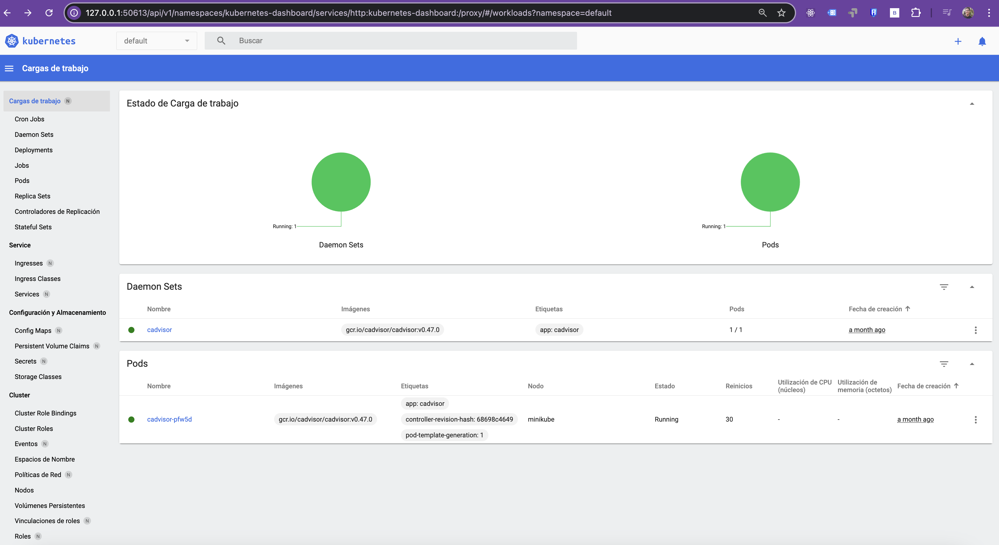

# Deploying a Python Application on Kubernetes Using Minikube

## Table of Contents

- [Introduction](#introduction)
  - [What is Kubernetes?](#what-is-kubernetes)
  - [What is Minikube?](#what-is-minikube)
  - [What is kubectl?](#what-is-kubectl)
  - [What is YAML?](#what-is-yaml)
- [Prerequisites](#prerequisites)
- [Navigate to the Application Directory](#navigate-to-the-application-directory)
- [Starting Minikube](#starting-minikube)
- [Accessing the Kubernetes Dashboard](#accessing-the-kubernetes-dashboard)
- [Deploying the Application](#deploying-the-application)
  - [Deployment YAML](#deployment-yaml)
  - [Service YAML](#service-yaml)
  - [Steps to Deploy](#steps-to-deploy)
- [Exploring the Application in the Dashboard](#exploring-the-application-in-the-dashboard)
- [Accessing the Application](#accessing-the-application)
- [Final Objective](#final-objective)
- [Next Steps](#next-steps)

---

## Introduction

This exercise will guide you through deploying a Python application to Kubernetes using Minikube with Colima and Docker as the container runtime. You will configure the deployment, expose the service, and explore the Kubernetes dashboard to observe the running application.

### What is Kubernetes?

Kubernetes (K8s) is an open-source platform that automates the deployment, scaling, and management of containerized applications. It provides a resilient framework to run distributed systems reliably.

#### Key Features:

- **Automatic bin packing**: Allocates resources based on container requirements.
- **Self-healing**: Restarts or replaces containers as needed.
- **Horizontal scaling**: Dynamically scales applications based on demand.
- **Service discovery and load balancing**: Manages traffic routing between applications.
- **Automated rollouts and rollbacks**: Simplifies application updates.

### What is Minikube?

Minikube is a lightweight Kubernetes implementation for local development and testing. It creates a single-node Kubernetes cluster on your local machine, enabling you to learn and experiment with Kubernetes.

#### Why Use Minikube?

- **Simple Setup**: Quickly spin up a Kubernetes environment.
- **Feature Support**: Most Kubernetes features, such as DNS and dashboards, are available.
- **Resource Management**: Manage cluster resources locally without affecting production.

### What is kubectl?

`kubectl` is the command-line tool for interacting with Kubernetes clusters. It allows you to deploy applications, inspect resources, and manage clusters.

#### Common Commands:

- `kubectl get pods`: List all running pods.
- `kubectl apply -f <file.yaml>`: Apply configuration from a YAML file.
- `kubectl delete -f <file.yaml>`: Delete resources defined in a YAML file.

### What is YAML?

YAML (YAML Ain't Markup Language) is a data serialization format used to configure Kubernetes resources. It is human-readable and ideal for defining structured data.

#### Key YAML Concepts:

- **apiVersion**: Defines the Kubernetes API version.
- **kind**: Specifies the resource type (e.g., Deployment, Service).
- **metadata**: Contains resource information like names and labels.
- **spec**: Describes the desired state of the resource.

---

## Prerequisites

Before starting, ensure you have completed Exercises 1–3.  
In this exercise, we’ll start using **Minikube** to run Kubernetes locally.  
Make sure it is installed and running using **Colima + Docker**. You can find setup instructions in the [installation guide](../../installation.md).

---

## Navigate to the Application Directory

To begin, navigate to the directory for Exercise 4:

```bash
cd sre-academy-training/exercises/exercise4
````

This directory contains the necessary YAML files for the deployment and service configuration.

---

## Starting Minikube

Start your local Kubernetes cluster using the Docker runtime:

```bash
minikube start --driver=docker
```

Verify the setup:

```bash
minikube status
```

---

## Accessing the Kubernetes Dashboard

Launch the Kubernetes dashboard:

```bash
minikube dashboard
```

When the dashboard opens in your browser, **notice that it is currently empty**. This is expected because you haven't deployed any applications yet.

The Kubernetes Dashboard is a **web-based user interface** that allows you to:

* **Deploy containerized applications** to a Kubernetes cluster.
* **Troubleshoot your applications** by inspecting logs and monitoring resource usage.
* **Manage cluster resources** like Deployments, Pods, Services, and more.

> **Note:** The `minikube dashboard` command will keep running in your terminal.
> To proceed with the next steps, you will need to **open an additional terminal window** or press `Ctrl + C` in the current terminal to close the dashboard and then reopen it later.

---

## Deploying the Application

The necessary YAML files for the deployment and service are already present in the `exercise4` directory.

### Deployment YAML

The `deployment.yaml` defines the application's deployment, including replicas and container image.

### Service YAML

The `service.yaml` exposes the application using a NodePort.

### Steps to Deploy

1. Apply the Deployment:

   ```bash
   kubectl apply -f deployment.yaml
   ```

2. **Verify the Pods (Initial State):**

   After applying the deployment, the Kubernetes cluster will start pulling the image and creating the pods. This process can take up to **1–2 minutes** depending on your network speed.

   Run the following command to observe the status:

   ```bash
   kubectl get pods -A
   ```

   You should see your `sre-abc-training-app` pods in a `ContainerCreating` or `Pending` status initially.
   **Wait until all three pods show `1/1` in the `READY` column and `Running` in the `STATUS` column** before moving to the next step. You may need to run this command multiple times.

3. Apply the Service:

   ```bash
   kubectl apply -f service.yaml
   ```

4. Verify the Service:

   ```bash
   kubectl get service sre-abc-training-service
   ```

   This command will show you the service details, including the dynamically assigned **NodePort** (usually in the `30000–32767` range).  
   Take note of the port number displayed under the `PORT(S)` column — you'll use it to access the application from your browser.

---

## Exploring the Application in the Dashboard

Now that your application is deployed, let's look at the dashboard again.

1. Open the Minikube dashboard (if you closed it earlier):

   ```bash
   minikube dashboard
   ```

2. **Explore the Dashboard with Data:**

   You will now see data populating the dashboard. Explore the following sections:

   * **Workloads → Deployments**: View the `sre-abc-training-app` deployment, confirming it has 3 replicas, and observe their current status.
   * **Workloads → Pods**: See individual pods for your application, their status, and logs.
   * **Network → Services**: Review the `sre-abc-training-service`, its type (`NodePort`), and the associated pods.

---

## Accessing the Application

To directly access your application from your web browser:

1. Get the URL for your service:

   ```bash
   minikube service sre-abc-training-service --url
   ```

   This command will output the URL (e.g., `http://192.168.49.2:30007`).

2. Open the URL in your web browser. You should see "Hello, World!" displayed.

---

## Final Objective

At the end of this exercise, you should accomplish the following:

> **\[IMPORTANT]**
> Use the Minikube dashboard to inspect the deployment and service. Ensure all pods are running, and the application is accessible.
> 

---

## Next Steps

In [Exercise 4.1](../exercise4.1), you will learn how to automate the setup and configuration of your local development environment using **Ansible**. This is a crucial step towards understanding how to manage infrastructure programmatically.

You should now be confident with:

* Understanding what Kubernetes is and how to deploy to it.
* Starting a local Kubernetes cluster with Minikube.
* Creating deployments and services using YAML files.
* Using the Kubernetes Dashboard to inspect workloads and services.

---