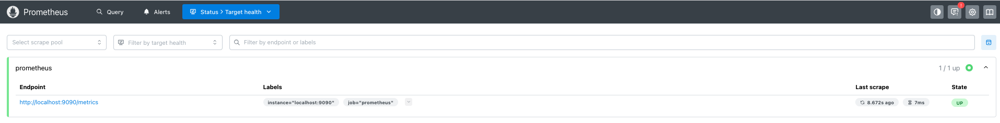

# **Deploying Prometheus in Minikube**

## **Table of Contents**

* [Navigate to the Exercise Directory](#navigate-to-the-exercise-directory)
* [Overview](#overview)
* [Key Features of Prometheus](#key-features-of-prometheus)
* [Architecture](#architecture)
* [Use Cases](#use-cases)
* [Traditional Installation (Reference)](#traditional-installation-reference)
* [Prometheus Installation in Kubernetes](#prometheus-installation-in-kubernetes)

  * [Step 1: Namespace Creation](#step-1-namespace-creation)
  * [Step 2: Prometheus Configuration](#step-2-prometheus-configuration)
  * [Step 3: Prometheus Deployment](#step-3-prometheus-deployment)
  * [Step 4: Prometheus Service](#step-4-prometheus-service)
  * [Step 5: Verify Prometheus Setup](#step-5-verify-prometheus-setup)
* [Using Ansible to Deploy](#using-ansible-to-deploy)
* [Final Objective](#final-objective)
* [Next Steps](#next-steps)

---

## **Navigate to the Exercise Directory**

```bash
cd sre-academy-training/exercises/exercise5
```

> This folder contains all required files, including `prometheus.yaml`, `infra.yaml`, and related assets.

---

## **Overview**

In this exercise, you'll deploy **Prometheus** in a local Kubernetes cluster running in **Minikube**. You’ll use both `kubectl` and **Ansible** to automate the deployment. This is the first step in setting up a complete observability stack.

---

## **Key Features of Prometheus**

* **Time-series data storage**
* **Powerful query language (PromQL)**
* **Dynamic service discovery**
* **Built-in alerting**
* **Grafana integration**

---

## **Architecture**

Prometheus consists of:

* `prometheus-server` – collects and stores metrics
* `exporters` – expose metrics to scrape
* `Alertmanager` – handles notifications
* `Pushgateway` – optional for short-lived jobs
* Client libraries – for instrumenting apps


---

## **Use Cases**

* Kubernetes cluster monitoring
* Alerting on system and app failures
* Monitoring microservices and APIs
* Observability in CI/CD pipelines

---

## **Traditional Installation (Reference)**

Although not required for this exercise, Prometheus can be installed locally using Homebrew:

```bash
brew install prometheus
brew services start prometheus
```

You can also run it manually:

```bash
prometheus --config.file=/opt/homebrew/etc/prometheus.yml
```

In this exercise, we’ll use a Kubernetes-native deployment instead.

---

## **Prometheus Installation in Kubernetes**

Make sure **Minikube** is running and using the `docker` driver before you continue.

```bash
minikube status
```

---

### **Step 1: Namespace Creation**

We isolate monitoring components in their own namespace:

```yaml
apiVersion: v1
kind: Namespace
metadata:
  name: monitoring
```

---

### **Step 2: Prometheus Configuration**

Prometheus is configured using a ConfigMap:

```yaml
apiVersion: v1
kind: ConfigMap
metadata:
  name: prometheus-config
  namespace: monitoring
data:
  prometheus.yml: |
    global:
      scrape_interval: 15s

    scrape_configs:
      - job_name: 'prometheus'
        static_configs:
          - targets: ['localhost:9090']
```

> ⚠️ This setup scrapes only itself. You’ll add external scrape targets in later exercises.

---

### **Step 3: Prometheus Deployment**

The Prometheus pod runs from the official container image:

```yaml
apiVersion: apps/v1
kind: Deployment
metadata:
  name: prometheus-deployment
  namespace: monitoring
spec:
  replicas: 1
  ...
```

---

### **Step 4: Prometheus Service**

Expose the pod using a `NodePort` service:

```yaml
apiVersion: v1
kind: Service
metadata:
  name: prometheus-service
  namespace: monitoring
spec:
  selector:
    app: prometheus
  ports:
    - port: 9090
      targetPort: 9090
  type: NodePort
```

---

### **Step 5: Verify Prometheus Setup**

Apply the manifest:

```bash
kubectl apply -f prometheus.yaml
```

Check the pod status:

```bash
kubectl get pods -n monitoring
```

Access the Prometheus UI:

```bash
minikube service prometheus-service -n monitoring
```

---

## **Using Ansible to Deploy**

You can automate the entire setup using the `infra.yaml` playbook:

1. Make sure you've completed [Exercise 4.1](../exercise4.1) — we need `inventory.ini`.

2. Run:

```bash
ansible-playbook -i ../exercise4.1/ansible_quickstart/inventory.ini infra.yaml
```

This applies the Prometheus configuration using `kubectl`.

---

## **Final Objective**

You should now have Prometheus running inside Minikube. Open the Prometheus dashboard and verify it's working by:

* Navigating to **Status > Target Health** (blue icon) to check the health of your targets.
* Optionally, running PromQL queries like:

  * `up`
  * `prometheus_build_info`

Expected output:



> You’ll only see metrics from Prometheus itself for now. More targets will be added in upcoming exercises.

---

## **Next Steps**

In [Exercise 6](../exercise6), we’ll deploy **Grafana** and configure it to pull data from Prometheus. This will allow us to visualize metrics using dashboards and begin building a complete observability stack.

You should now be confident with:

* Understanding how Prometheus works inside Kubernetes.
* Deploying services using both `kubectl` and Ansible.
* Exposing services with NodePort.
* Verifying Prometheus targets and data.

---
