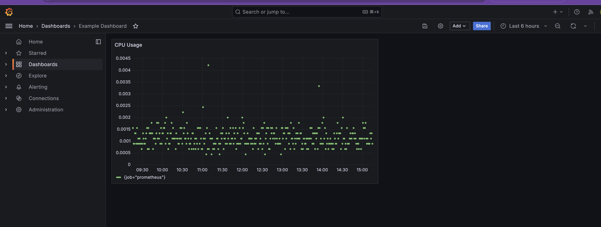

# **Deploying Grafana in Minikube**

## **Table of Contents**

* [Navigate to the Application Directory](#navigate-to-the-application-directory)
* [Overview](#overview)
* [Key Features of Grafana](#key-features-of-grafana)
* [Architecture](#architecture)
* [Use Cases](#use-cases)
* [Traditional Installation](#traditional-installation)
* [Grafana Installation Steps](#grafana-installation-steps)

  * [Step 1: Namespace Creation](#step-1-namespace-creation)
  * [Step 2: Grafana Deployment and Service](#step-2-grafana-deployment-and-service)
  * [Step 3: Configuring Prometheus as a Data Source](#step-3-configuring-prometheus-as-a-data-source)
  * [Step 4: Provisioning Dashboards](#step-4-provisioning-dashboards)
  * [Step 5: Verifying the Configuration](#step-5-verifying-the-configuration)
* [Running the Playbook](#running-the-playbook)
* [Final Objective](#final-objective)
* [Next Steps](#next-steps)

---

## **Navigate to the Application Directory**

```bash
cd sre-academy-training/exercises/exercise6
```

> This folder contains all the YAML files necessary to deploy Grafana and configure it with Prometheus.

---

## **Overview**

Grafana is an open-source platform used for monitoring and observability. It provides advanced visualization capabilities and integrates seamlessly with Prometheus. In this exercise, you'll deploy Grafana inside your Minikube cluster and verify its integration with Prometheus (set up in Exercise 5).

> **Reminder:** Make sure Minikube and Colima are running before proceeding.

---

## **Key Features of Grafana**

* Customizable dashboards
* Integration with multiple data sources
* Advanced alerting and notifications
* User access control and RBAC

---

## **Architecture**

Grafana is composed of the following key components:

* **Dashboard** – Visual interface to view metrics.
* **Data Sources** – Supports Prometheus, InfluxDB, and more.
* **Alerting** – Built-in rule-based alerts and notifications.

---

## **Use Cases**

* Real-time app and system monitoring
* Infrastructure performance tracking
* Visualizing data from cloud-native services
* Alerting based on system metrics

---

## **Traditional Installation (macOS)**

These are the steps for local installation using Homebrew (optional):

```bash
brew install grafana
brew services start grafana
```

Access Grafana at: [http://localhost:3000](http://localhost:3000)
Default credentials: `admin / admin`

> For this exercise, we’ll focus on deploying Grafana using Kubernetes.

---

## **Grafana Installation Steps**

### **Step 1: Namespace Creation**

```yaml
apiVersion: v1
kind: Namespace
metadata:
  name: monitoring
```

### **Step 2: Grafana Deployment and Service**

```yaml
# Deployment
apiVersion: apps/v1
kind: Deployment
metadata:
  name: grafana-deployment
  namespace: monitoring
spec:
  replicas: 1
  template:
    spec:
      containers:
        - name: grafana
          image: grafana/grafana:latest
          ports:
            - containerPort: 3000
```

```yaml
# Service
apiVersion: v1
kind: Service
metadata:
  name: grafana-service
  namespace: monitoring
spec:
  selector:
    app: grafana
  ports:
    - port: 3000
      targetPort: 3000
  type: NodePort
```

### **Step 3: Configuring Prometheus as a Data Source**

```yaml
apiVersion: v1
kind: ConfigMap
metadata:
  name: grafana-datasources-config
  namespace: monitoring
data:
  datasources.yaml: |
    datasources:
      - name: Prometheus
        type: prometheus
        url: http://prometheus-service.monitoring.svc.cluster.local:9090
        isDefault: true
```

### **Step 4: Provisioning Dashboards**

```yaml
apiVersion: v1
kind: ConfigMap
metadata:
  name: grafana-dashboards-config
  namespace: monitoring
data:
  dashboards.yaml: |
    providers:
      - name: 'default'
        type: file
        options:
          path: /etc/grafana/provisioning/dashboards
  example-dashboard.json: |
    {
      "title": "Example Dashboard",
      "panels": [
        {
          "title": "CPU Usage",
          "targets": [
            {
              "expr": "sum by(job) (rate(process_cpu_seconds_total[1m]))"
            }
          ],
          "type": "graph"
        }
      ]
    }
```

### **Step 5: Verifying the Configuration**

```bash
kubectl apply -f grafana.yaml
kubectl get pods -n monitoring
minikube service grafana-service -n monitoring
```

> Login with `admin/admin`, then go to **Configuration > Data Sources** to check Prometheus, and **Dashboards** to see the "Example Dashboard".

---

## **Running the Playbook**

If you completed Exercise 4.1, you can automate the deployment using Ansible:

```bash
ansible-playbook -i ../exercise4.1/ansible_quickstart/inventory.ini infra.yaml
```

---

## **Final Objective**

Once complete, validate the following in Grafana:

* ✅ Prometheus is listed as a data source
* ✅ The “Example Dashboard” is present under **Dashboards**
* ✅ The CPU Usage panel is showing data



> This panel uses Prometheus metrics collected from its own process. You’ll integrate more targets in upcoming exercises.

---

## **Next Steps**

In [Exercise 7](../exercise7), we’ll configure **cAdvisor** to collect system-level container metrics and expose them to Prometheus. You’ll also update your Prometheus config to start scraping cAdvisor — making your dashboards more informative and complete.

You should now be confident with:

* Deploying Grafana inside Kubernetes
* Configuring Prometheus as a data source
* Automating deployments with Ansible
* Viewing dashboards with basic Prometheus metrics

---