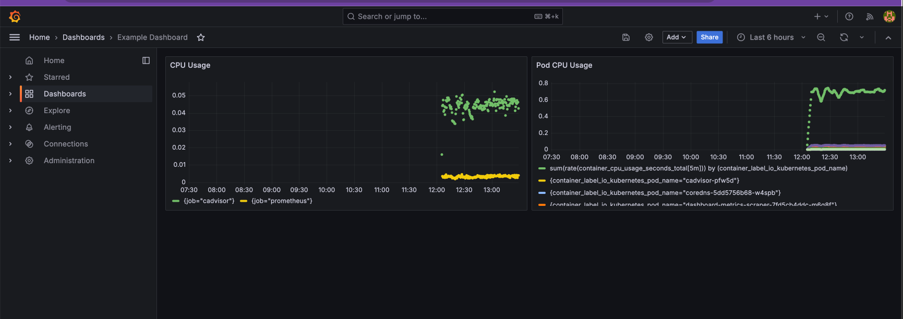

# **Deploying cAdvisor and Grafana in Minikube**

## **Table of Contents**

* [Navigate to the Application Directory](#navigate-to-the-application-directory)
* [Overview](#overview)
* [Install cAdvisor](#install-cadvisor)
* [Key Features](#key-features)
* [Integration with Prometheus](#integration-with-prometheus)
* [How It Works](#how-it-works)
* [Step 1: Running cAdvisor](#step-1-running-cadvisor)
* [Prometheus Configuration Reference](#prometheus-configuration-reference)
* [Validate Metrics Collection](#validate-metrics-collection)
* [Use the Metric to Build a Graph](#use-the-metric-to-build-a-graph)
* [Automated Grafana Panel](#automated-grafana-panel)
* [Final Objective](#final-objective)
* [Next Steps](#next-steps)

---

## **Navigate to the Application Directory**

To begin, navigate to the directory for Exercise 7:

```bash
cd sre-academy-training/exercises/exercise7
```

> **Note**: This directory contains the necessary files for the exercise.
> **Important**: Before proceeding, ensure that **Minikube is running** properly.

---

## **Overview**

In this exercise, we integrate **cAdvisor** with **Prometheus** to collect container-level metrics and display them in **Grafana**. You'll be able to visualize metrics such as CPU usage by pod.


Before applying changes, it's helpful to check the current metric count:

```promql
count({__name__=~".+"})
```

> This query shows the number of metrics currently available in Prometheus. Run it **before and after** deploying cAdvisor to confirm that additional metrics are being collected.

To access Prometheus:

```bash
minikube service start prometheus-service -n monitoring
```

---

## **Install cAdvisor**

### **Key Features**

* Real-time monitoring of running containers.
* CPU, memory, filesystem, and network usage stats.
* Built-in integration with Docker-compatible runtimes.

### **Integration with Prometheus**

**cAdvisor** exposes a `/metrics` endpoint on port `8080`, which Prometheus can scrape using Kubernetes pod service discovery.

### **How It Works**

1. **cAdvisor runs as a standalone pod**.
2. Prometheus scrapes cAdvisor metrics exposed via `/metrics`.
3. The collected metrics are available for graphing in Grafana.

---

## **Step 1: Running cAdvisor**

Deploy cAdvisor using the provided YAML file:

```bash
kubectl apply -f cadvisor.yaml
```

Verify that the pod is running (in the **default** namespace):

```bash
kubectl get pods -n default
```

---

## **Step 2: Grant Prometheus Access via RBAC**

To allow Prometheus to scrape metrics from cAdvisor (which runs in the `default` namespace), apply the provided ClusterRole and ClusterRoleBinding configuration:

```bash
kubectl apply -f prometheus-rbac-cluster.yaml
```

> **Why this is necessary**: Prometheus runs under a service account in the `monitoring` namespace, but cAdvisor is running in the `default` namespace. This RBAC configuration grants cluster-wide read permissions on pods and endpoints to Prometheus so it can discover and scrape metrics from any namespace.

You can verify the role binding was created with:

```bash
kubectl get clusterrolebinding prometheus-pod-reader-binding-cluster
```

---

## **Prometheus Configuration Reference**

The Prometheus job to scrape cAdvisor is **already included** in the `prometheus.yaml` file provided in this exercise.

You do **not** need to modify anything, but here’s the relevant block for reference:

```yaml
- job_name: 'cadvisor'
  kubernetes_sd_configs:
    - role: pod
  relabel_configs:
    - source_labels: [__meta_kubernetes_pod_label_app]
      action: keep
      regex: cadvisor
  metrics_path: /metrics
  scheme: http
```

> **Note**: This configuration tells Prometheus to find pods labeled `app=cadvisor` and scrape metrics from them.

---

## **Validate Metrics Collection**

After waiting a few seconds, access Prometheus and run the following query again:

```promql
count({__name__=~".+"})
```

> If cAdvisor was integrated successfully, the metric count should increase. This confirms Prometheus is now scraping container-level metrics.

---

## **Use the Metric to Build a Graph**

One of the most useful cAdvisor metrics is per-pod CPU usage:

```promql
sum(rate(container_cpu_usage_seconds_total[5m])) by (container_label_io_kubernetes_pod_name)
```

> You can run this query in Prometheus or Grafana, and **toggle between the Table and Graph views** to observe how the data is visualized differently. This is a good moment to explore and understand what each view offers in terms of insights.

---

## **Automated Grafana Panel**

The `grafana.yaml` file in this exercise already includes a preconfigured panel using the above query.

> **Note**: You don’t need to modify or update anything manually. This automation ensures the panel is rendered automatically once Grafana is deployed.

To deploy Grafana:

```bash
kubectl apply -f grafana.yaml
```

Monitor the pod until it’s ready:

```bash
kubectl get pods -n monitoring
```

Once the `grafana-deployment-...` pod is running, access Grafana:

```bash
minikube service grafana-service -n monitoring
```

Login credentials (by default):

* **User**: admin
* **Password**: admin

---

## **Final Objective**

At the end of this exercise, you should be able to:

* See increased metrics in Prometheus after deploying cAdvisor.
* Visualize container CPU usage by pod in Grafana.
* Automate the setup using YAML files provided in this exercise.



---

## **Next Steps**

In [Exercise 8](../exercise8), we’ll take observability to the next level by introducing **OpenTelemetry traces**. You'll learn how to instrument services and generate trace-based metrics to complement the metrics we’ve already explored.

You should now be confident with:

* Deploying cAdvisor for container-level monitoring.
* Verifying metrics using Prometheus queries.
* Automating Grafana dashboards for real-time visual insights.

---
