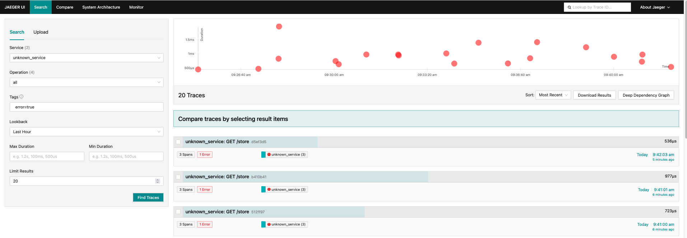
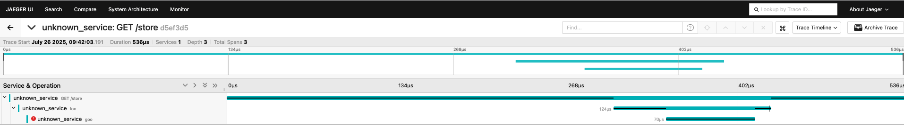
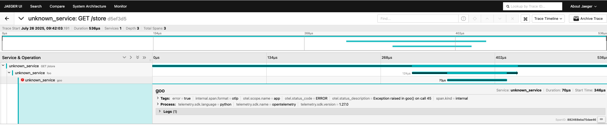

# Instrumenting a Python Application with OpenTelemetry for Distributed Tracing

## **Table of Contents**

* [Overview](#overview)
* [Navigate to the Directory](#navigate-to-the-directory)
* [Required Files](#required-files)
* [Step 1: Review the Instrumented Python Application](#step-1-review-the-instrumented-python-application)
* [Step 2: Deploy the OpenTelemetry Collector and Jaeger](#step-2-deploy-the-opentelemetry-collector-and-jaeger)
* [Step 3: Run the Instrumented Application](#step-3-run-the-instrumented-application)
* [Step 4: Automating with Ansible (Optional)](#step-4-automating-with-ansible-optional)
* [Visualizing Traces in Jaeger](#visualizing-traces-in-jaeger)
* [Next Steps](#next-steps)

---

## **Overview**

In this exercise, you will instrument a **Python application** to generate traces and send them to an **OpenTelemetry Collector**, which then forwards them to **Jaeger for visualization**. This enables **end-to-end distributed tracing**, allowing you to analyze request flow, detect latency, and troubleshoot issues across services.

---

## **Navigate to the Directory**

Before starting, navigate to the exercise folder:

```bash
cd sre-academy-training/exercises/exercise8
```

---

## **Required Files**

These files are already provided in this directory:

* `app.py` – Python app instrumented with OpenTelemetry.
* `deployment.yaml` – Deploys the instrumented app into Kubernetes.
* `otel-collector.yaml` – Deploys the OpenTelemetry Collector and its config.
* `jaeger.yaml` – Deploys Jaeger tracing backend.
* `Dockerfile` – Defines how the app is containerized.

---

## **Step 1: Review the Instrumented Python Application**

The app is already instrumented to export trace data using OpenTelemetry. Below is a breakdown of key configurations:

### **Installed Libraries in `Dockerfile`:**

```dockerfile
RUN pip install flask \
    opentelemetry-api \
    opentelemetry-sdk \
    opentelemetry-exporter-otlp-proto-grpc \
    opentelemetry-instrumentation-flask
```

### **Instrumentation Setup in `app.py`:**

```python
from opentelemetry import trace
from opentelemetry.exporter.otlp.proto.grpc.trace_exporter import OTLPSpanExporter
from opentelemetry.sdk.trace import TracerProvider
from opentelemetry.sdk.trace.export import BatchSpanProcessor
from opentelemetry.sdk.resources import Resource

resource = Resource.create({"service.name": "sre-abc-training-app"})

span_exporter = OTLPSpanExporter(
    endpoint="otel-collector.opentelemetry.svc.cluster.local:4317",
    insecure=True
)

tracer_provider = TracerProvider(resource=resource)
tracer_provider.add_span_processor(BatchSpanProcessor(span_exporter))
trace.set_tracer_provider(tracer_provider)
```

Additional instrumentation includes:

* Auto-instrumentation of Flask routes with `FlaskInstrumentor().instrument_app(app)`
* Middleware for WSGI compatibility.
* Manual spans for demo functions like `foo()`, `goo()`, and `zoo()`.

---

## **Step 2: Deploy the OpenTelemetry Collector and Jaeger**

This step sets up the telemetry pipeline:

```bash
kubectl apply -f otel-collector.yaml
kubectl apply -f jaeger.yaml
```

### Check Pod Status

```bash
kubectl get pods -n opentelemetry
```

Wait for all pods to be in the `Running` state.

### Access Jaeger UI

```bash
minikube service jaeger-service -n opentelemetry
```

You should see a browser window with the Jaeger dashboard.

---

## **OpenTelemetry Collector Breakdown**

This file (`otel-collector.yaml`) deploys the collector and configures it to:

* Receive traces using OTLP gRPC.
* Export traces to Jaeger and a debug log.

### **Collector Deployment**

```yaml
apiVersion: apps/v1
kind: Deployment
metadata:
  name: otel-collector
  namespace: opentelemetry
spec:
  replicas: 1
  selector:
    matchLabels:
      app: otel-collector
  template:
    metadata:
      labels:
        app: otel-collector
    spec:
      containers:
        - name: otel-collector
          image: otel/opentelemetry-collector-contrib:0.111.0
          args:
            - "--config=/etc/otel-collector-config.yaml"
          ports:
            - containerPort: 4317
          volumeMounts:
            - name: otel-config
              mountPath: /etc/otel-collector-config.yaml
              subPath: config.yaml
      volumes:
        - name: otel-config
          configMap:
            name: otel-config
```

### **Collector Configuration (`ConfigMap`)**

```yaml
apiVersion: v1
kind: ConfigMap
metadata:
  name: otel-config
  namespace: opentelemetry
data:
  config.yaml: |
    receivers:
      otlp:
        protocols:
          grpc:
            endpoint: 0.0.0.0:4317

    exporters:
      otlp/jaeger:
        endpoint: "jaeger:4317"
        tls:
          insecure: true
      debug: {}

    processors:
      batch: {}

    service:
      pipelines:
        traces:
          receivers: [otlp]
          processors: [batch]
          exporters: [debug, otlp/jaeger]
```

### **Collector Service**

```yaml
apiVersion: v1
kind: Service
metadata:
  name: otel-collector
  namespace: opentelemetry
spec:
  selector:
    app: otel-collector
  ports:
    - protocol: TCP
      port: 4317
      targetPort: 4317
  type: NodePort
```

---

## **Jaeger Breakdown**

The `jaeger.yaml` file deploys Jaeger in the same namespace:

```yaml
apiVersion: apps/v1
kind: Deployment
metadata:
  name: jaeger
  namespace: opentelemetry
spec:
  replicas: 1
  selector:
    matchLabels:
      app: jaeger
  template:
    metadata:
      labels:
        app: jaeger
    spec:
      containers:
        - name: jaeger
          image: jaegertracing/all-in-one:1.51
          ports:
            - containerPort: 16686  # Jaeger UI
            - containerPort: 4317   # OTLP endpoint
```

### **Jaeger Service**

```yaml
apiVersion: v1
kind: Service
metadata:
  name: jaeger-service
  namespace: opentelemetry
spec:
  selector:
    app: jaeger
  ports:
    - name: ui
      port: 16686
      targetPort: 16686
      nodePort: 30009
    - name: otlp
      port: 4317
      targetPort: 4317
  type: NodePort
```

This allows:

* External access to the Jaeger UI via NodePort `30009`.
* OTLP traces to be received on port `4317`.

---

## **Step 3: Run the Instrumented Application**

Once the tracing backend is live, deploy the application:

```bash
kubectl apply -f deployment.yaml
```

### Verify Pod Status

```bash
kubectl get pods -n application
```

Wait until the pod shows `1/1 Running`.

---

## **Step 4: Automating with Ansible (Optional)**

Instead of applying resources manually, you can automate everything:

```yaml
- name: Deploy OpenTelemetry Stack
  hosts: all
  tasks:
    - name: Deploy Collector
      command: kubectl apply -f otel-collector.yaml

    - name: Deploy Jaeger
      command: kubectl apply -f jaeger.yaml

    - name: Deploy App
      command: kubectl apply -f deployment.yaml
```

Run the playbook:

```bash
ansible-playbook -i inventory.ini deploy.yaml
```

---

## **Visualizing Traces in Jaeger**

Once the app is running, traces should appear automatically.

### Access Jaeger Dashboard

```bash
minikube service jaeger-service -n opentelemetry
```

### View Traces

In the Jaeger UI:

* **Service**: Select `unknown_service`
* **Tags (Optional)**: Add `error=true`
* Click **Find Traces**

### Sample Screenshots

* Trace Dashboard
  

* Trace Detail
  

* Trace with Error
  

---

## **Next Steps**

In [Exercise 9](../exercise9), you'll move beyond trace generation to explore **trace-based metrics** using **Prometheus** and the **SpanMetrics connector** in OpenTelemetry. This allows you to extract metrics from traces and visualize them in **Grafana** — bridging the gap between observability pillars.

You should now be comfortable with:

* Instrumenting a Python app with OpenTelemetry.
* Exporting traces via OTLP to a collector.
* Using Jaeger to visualize service latency and errors.

---