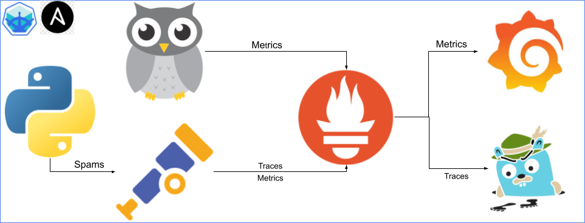
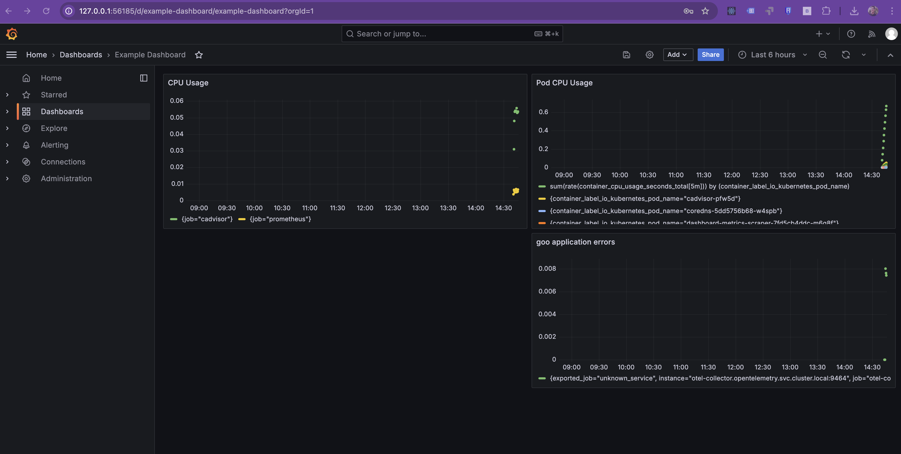

# Generating Trace-Based Metrics Using OpenTelemetry and Prometheus

## Table of Contents

- [Overview](#overview)
- [Navigate to the Directory](#navigate-to-the-directory)
- [Understanding the Configuration](#understanding-the-configuration)
  - [OpenTelemetry Collector Example](#opentelemetry-collector-example)
    - [Exporters and Connectors Definition](#exporters-and-connectors-definition)
    - [Service Pipelines Configuration](#service-pipelines-configuration)
- [Deploy the Environment](#deploy-the-environment)
- [Accessing Prometheus and Grafana](#accessing-prometheus-and-grafana)
  - [Prometheus](#prometheus)
  - [View the Dashboard in Grafana](#view-the-dashboard-in-grafana)
- [Final Objective](#final-objective)
- [Next Steps](#next-steps)

---

## Overview

In this exercise, we generate **trace-based metrics** using the OpenTelemetry Collector and visualize them with Prometheus and Grafana. The core idea is to observe how application traces can be converted into Prometheus-style metrics using the `spanmetrics` connector. This allows you to monitor request counts, latencies, and errors — even if your application doesn't emit traditional metrics.

Key components involved:

- **Flask Python App** (instrumented with OpenTelemetry SDK)
- **OpenTelemetry Collector** (with `spanmetrics` and Prometheus exporter)
- **Jaeger** (for traces)
- **Prometheus** (for metrics)
- **Grafana** (for visualization)



---

## Navigate to the Directory

```bash
cd sre-academy-training/exercises/exercise9
````

---

## Understanding the Configuration

The OpenTelemetry Collector is the core of this exercise. It receives traces from the application, processes them, converts them into metrics using the `spanmetrics` connector, and exports them to Prometheus. This allows us to track things like request latency and error rates based on trace data.

### OpenTelemetry Collector Example

File: `otel-collector.yaml`

Here are the most important sections of the configuration file that make this possible:

---

#### Exporters and Connectors Definition

This block defines how the collector sends data out (exporters) and how it transforms it internally (connectors). The `debug` exporter is useful for troubleshooting and validating incoming data.

```yaml
exporters:
  otlp/jaeger:
    endpoint: "jaeger:4317"
    tls:
      insecure: true
  prometheus:
    endpoint: "0.0.0.0:9464"
    namespace: "otel_collector"
  debug: {}

connectors:
  spanmetrics:
    namespace: span.metrics # Converts trace spans into Prometheus metrics.
```

---

#### Service Pipelines Configuration

These pipelines define how logs, traces, and metrics flow through the collector. Each pipeline connects receivers (data input), processors (data transformation), and exporters/connectors (data output).

```yaml
service:
  pipelines:
    logs:
      receivers: [otlp]
      processors: [batch]
      exporters: [debug] # Sends logs to debug output
    traces:
      receivers: [otlp]
      processors: [batch]
      exporters: [debug, otlp/jaeger, spanmetrics] # Sends traces to Jaeger, debug, and spanmetrics
    metrics:
      receivers: [prometheus, otlp, spanmetrics] # Accepts metrics from multiple sources
      processors: [batch]
      exporters: [debug, prometheus] # Exports metrics to Prometheus and debug
```

This setup is essential for transforming tracing data into real-time, queryable metrics.

---

## Deploy the Environment

To deploy all components automatically, simply run the following script:

```bash
./cluster.sh
```

This script performs a complete setup of the Kubernetes environment, including:

* Deploying the sample Flask application with OpenTelemetry instrumentation.
* Deploying Jaeger for trace visualization.
* Deploying the OpenTelemetry Collector with `spanmetrics` and the proper pipeline.
* Deploying Prometheus and Grafana with preconfigured dashboards.

> ⚠️ Even after pods are running, it may take another 1-2 minutes for Prometheus to scrape the initial metrics and for Grafana dashboards to populate. This is due to scrape intervals and data processing time. If you don't see data immediately, give it a little more time and refresh your browser.

**Why this is important:**

Automating deployments ensures **consistency**, reduces **manual errors**, and reflects **real-world SRE practices**. This is especially valuable when managing complex observability stacks across environments.

---

## Accessing Prometheus and Grafana

### Prometheus

Open the Prometheus UI using:

```bash
minikube service prometheus-service -n monitoring
```

In the UI, search for metrics with the prefix:

```
otel_collector_span_metrics_calls_total
```

These are automatically generated from the application traces.

---

### View the Dashboard in Grafana

Once the deployment is complete and all pods are in the Running state, open Grafana:

```bash
minikube service grafana-service -n monitoring
```

Log in (default is usually `admin` / `admin`).
Navigate to Dashboards → Example Dashboard

* Locate the panel: **goo application errors**



---

## Final Objective

You should be able to observe real metrics derived from traces, including:

* Request count and latency
* Error count in the `/goo` route
* Automatic updates in both Grafana and Prometheus when load is generated

This enables a new dimension of observability by converting traces into actionable metrics, without requiring manual instrumentation of metrics in the application.

---

## Next Steps

In [Exercise 10](../exercise10), we’ll expand our observability stack by introducing **Grafana Loki** for centralized logging. You’ll learn how to capture application logs, correlate them with metrics and traces, and visualize everything in a unified dashboard.

You should now be confident with:

* Understanding how OpenTelemetry Collector pipelines work.
* Converting trace data into Prometheus metrics using the `spanmetrics` connector.
* Automating observability infrastructure with a deployment script.

---